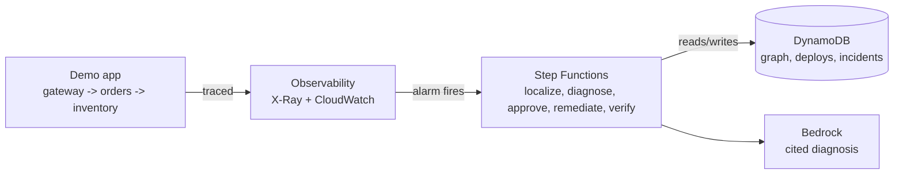

# Self-healing infra: causal root-cause localization + human-gated remediation

Built by [Saman Pandey](https://github.com/SamanPandey-in) & [Shreyash Singh](https://github.com/ShreyashSingh857).

## The problem

I run production infra for freelance clients through [Dreamer](https://github.com/SamanPandey-in/dreamer), a self-hosted deployment platform I built. When something breaks, the first 15–20 minutes of any incident aren't spent fixing anything, instead they're spent figuring out *which* service actually caused the problem, not just which one is currently on fire. A downstream service erroring is usually a symptom; the real cause is often an upstream deploy that happened minutes earlier. That gap between "something's broken" and "I know what broke it and why" is where outages get expensive, and it's a manual, repetitive process every time.

## Our approach

Four stages, each doing one job:

1. **Ingest** — capture real request traces and deploy history from a running system, continuously, with no manual instrumentation step
2. **Localize** — given an anomaly, don't just rank services by "who's erroring the most." Walk the actual call graph backward from the anomaly and rank upstream candidates by whether their most recent deploy precedes the anomaly's onset — topology and timing together, not either alone
3. **Diagnose** — turn the top candidate into a plain-English explanation, with every claim in that explanation tied to a citation (a span ID, a log line, a deploy version) so the diagnosis is checkable, not just plausible-sounding
4. **Remediate** — never act automatically. Propose a fix, pause for a human to approve it, then execute and verify the outcome

The AWS Ship It track's tool list — Lambda, API Gateway, DynamoDB, X-Ray, CloudWatch, EventBridge, Step Functions, Bedrock — maps onto this almost directly, which is part of why this project fit the track well: every stage above is backed by a load-bearing AWS service, not a decorative one.

## What we built

A 3-service demo system (`gateway` → `orders` → `inventory`) running on Lambda behind API Gateway, fully traced with X-Ray. A toggleable fault-injection flag on `inventory` lets us manufacture a real incident on demand instead of waiting for one. When it fires:

- A CloudWatch Alarm on `inventory`'s error rate triggers an EventBridge rule
- That starts a Step Functions execution (`IncidentResponse`) that rebuilds the current service graph from X-Ray's own `GetServiceGraph` API, ranks root-cause candidates using the temporal-precedence-over-topology heuristic described above, gets a cited diagnosis from a Claude model via Amazon Bedrock, and pauses at a `waitForTaskToken` step for a human to approve the fix over email
- On approval, a `Remediate` Lambda reverts the bad Lambda alias to its previous version, and a `VerifyOutcome` Lambda confirms the metrics actually recovered before closing the incident

A Next.js dashboard shows the live service graph, the open incident, the diagnosis with its citations, and the approval control.

## Basic HLD



Traffic flows left to right under normal conditions. The moment an anomaly trips the alarm, control passes to the Step Functions pipeline, which is the whole point of the project — everything to its left is just the system being watched; everything at and after it is the actual "self-healing" behavior.

## Impact

- **For me directly**: this is the tool I wished existed the last three times a Dreamer-hosted client deployment broke — it turns "which service is even the problem" from a 15-minute manual trace-read into an automated, cited answer
- **Generalizes beyond this demo**: the localization heuristic and citation-checked diagnosis pattern don't depend on the 3-service toy app — they apply to any system that emits X-Ray-style traces and records deploy events, which is most things running on Lambda or ECS already
- **Safety-first by design, not as an afterthought**: the approval gate and the citation-checking on the diagnosis are the two things that make this "safe self-healing" rather than "a script that reverts a Lambda on a hunch," and both survived every round of hackathon scope-cutting

## AWS services used

Lambda, API Gateway, DynamoDB, AWS X-Ray, CloudWatch (metrics, logs, alarms), EventBridge, Step Functions, Amazon Bedrock, Amazon SES, S3.

## CDK Construct

The entire self-healing pipeline is also packaged as a reusable CDK construct at `packages/cdk-self-healing/`. It takes a Lambda alias as a prop, and `cdk deploy` provisions every table, Lambda, alarm, state machine, and API endpoint in the consumer's own AWS account — no manual console configuration needed.

```typescript
const healing = new SelfHealingInfra(this, "Healing", {
  protectedAlias: myAlias,
  geminiApiKey: process.env.GEMINI_API_KEY!,
});
```

The construct is packaged and ready to publish. The repo, the build, the README, and the peer dependency setup are all in place. What actually matters is the artifact: the video shows it working, the repo has clean documented code, and the README shows how it would be used. 

## What's next

The localization heuristic here is an honest MVP — topology-constrained temporal precedence, not a true causal-discovery algorithm. The natural next step is a PC-algorithm-style constrained search over the same graph, plus a broader fault-type matrix beyond the single induced-latency case this demo covers.
