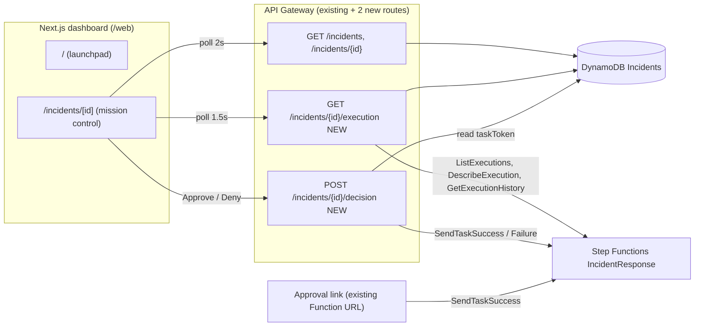
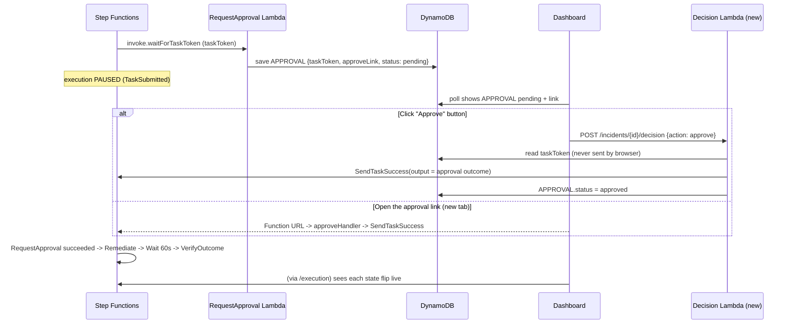

# Healr — Step Functions observability + in-app approval

A plan (with the complete, build-verified code) to turn the `/web` dashboard into a live "mission control" for the `IncidentResponse` state machine: every state's status, timing, input and output, the approval link, and an Approve button that resumes the real paused execution.

**Nothing existing is removed or rewritten in place on the backend.** The backend change is two new Lambdas, two new API routes and two lines in the stack file. The frontend adds no npm dependencies.

---

## 1. What "done" looks like

- [ ] The incident page shows all 8 Step Functions states, live, with status (`pending / running / waiting / succeeded / failed`), start time and duration.
- [ ] Clicking a state shows its real **Input / Output / Error** JSON from the execution history.
- [ ] While the execution is paused at `RequestApproval`, the page shows the **approval link** and **Approve / Deny** buttons.
- [ ] Clicking Approve (or opening the link) sends `SendTaskSuccess`; the same page then shows `RequestApproval → Succeeded`, `Remediate` running, the 60s settle timer, `VerifyOutcome`, and a "Self-healed" banner.
- [ ] Deploying the frontend *before* the backend changes does not break it (it falls back to a DynamoDB-derived view).

---

## 2. What is in the repo today (findings)

| Finding | Detail |
|---|---|
| Frontend shows DynamoDB rows only | `web/app/incidents/[id]/page.tsx` renders META / DIAGNOSIS / APPROVAL / REMEDIATION / VERIFICATION. It never calls Step Functions, so it cannot show per-state input/output, timing, retries or the paused state. |
| State machine | `IncidentResponseDay3`, 8 states: `CreateIncident → BuildGraph → LocalizeRootCause → DiagnoseWithBedrock → RequestApproval (waitForTaskToken, 30 min) → Remediate → WaitForMetricsToSettle (60s) → VerifyOutcome`. Confirmed by synthesizing the CDK stack. Tasks 1-4 and 6-8 carry a Retry policy (6 attempts). |
| The approval link already works | `requestApprovalHandler` stores `approveLink` on the APPROVAL row; `approveHandler` (Function URL) calls `SendTaskSuccess`. Your `docs/TEST_DAY3_2.md` checklist records it as tested. I could not run AWS, so I have not re-proven it. |
| Why the UI can't call the link with `fetch` | The Function URL has no CORS configuration (`plan5.md` §3.3 chose new-tab). The plan adds an API Gateway route that already has CORS. |
| Existing bug | `page.tsx` checks `msg.includes("409")`, but `armDemo` throws the response *body* (`{"error":"A demo is already running..."}`), which has no "409" in it, so that branch never fires. Fixed by throwing an `ApiError` with `.status`. |
| Existing UI bug | The "Approve remediation" button stays visible while `meta.status === "diagnosed"` even after approval. The new panel keys off `APPROVAL.status`. |
| Security note | `GET /incidents/{id}` returns the whole APPROVAL row, including `taskToken`. Anyone who can load an incident URL can approve it. Fine for a hackathon; see §12. |
| Naming mismatch | The state is called `DiagnoseWithBedrock` and the README says Bedrock, but the code calls Gemini (`geminiClient.ts`). Judges may notice; the UI labels it "Diagnose with AI". |

---

## 3. Architecture



**Where each thing on screen comes from**

| On screen | Source |
|---|---|
| Pipeline rows, durations, Input/Output/Error, retry count, event log | `GET /incidents/{id}/execution` (Step Functions history) |
| Diagnosis, evidence, service ranking, rollback versions, fault counts | `GET /incidents/{id}` (DynamoDB rows) |
| Approval link | `APPROVAL.approveLink` (DynamoDB) |

## 4. Approval flow



The `SendTaskSuccess` output in the new handler is byte-for-byte the shape the existing `approveHandler` sends (`incidentId, approved, rootCauseService, rankedCandidates, decidedAt`), because `Remediate` consumes it as its input. The approval is proven on screen by the `RequestApproval` row turning green with `approved: true` in its Output tab, followed by `Remediate` starting.

---

## 5. Change summary

**New files**

| File | Purpose |
|---|---|
| `server/src/features/incidents/executionView.ts` | Pure parser: Step Functions history events → per-state rows (redacts `taskToken`) |
| `server/src/features/incidents/executionHandler.ts` | `GET /incidents/{id}/execution` |
| `server/src/features/approval/decisionHandler.ts` | `POST /incidents/{id}/decision` |
| `infra/lib/observability.ts` | CDK: 2 Lambdas, IAM grants, 2 routes |
| `web/lib/types.ts`, `format.ts`, `pipeline.ts`, `usePoll.ts` | Types, formatters, pipeline model + DynamoDB fallback, polling hooks |
| `web/components/*.tsx` (11 files) | UI components |
| `scripts/check-execution-view.ts`, `check-handlers.ts`, `mock-api.ts` | Offline proof + offline demo API |

**Modified files**

| File | Change |
|---|---|
| `infra/lib/self-healing-infra-stack.ts` | +1 import, +1 call `createObservability(...)` |
| `web/lib/api.ts` | Same 4 exports (`armDemo`, `triggerOrder`, `listIncidents`, `getIncident`) plus `getExecution`, `decideIncident`, `ApiError`. Now throws on non-2xx and `listIncidents` always returns an array |
| `web/app/page.tsx`, `web/app/incidents/[id]/page.tsx`, `web/app/globals.css` | Redesigned |

**Not touched:** every existing Lambda handler, the state machine definition, the alarm/EventBridge rule, `approveHandler` (the link keeps working exactly as today), `web/package.json`, `web/app/layout.tsx`.

---

## 6. Phase 1 — Backend

### 6.1 History parser (pure, unit-tested)

Turns Step Functions' flat event list into one row per state. Handles the two callback events (`TaskSubmitted` = paused for a human, `WaitStateEntered` = timer), retries (each re-schedule bumps `attempts`) and failures.


**`server/src/features/incidents/executionView.ts`**

```ts
import type { DescribeExecutionCommandOutput, HistoryEvent } from "@aws-sdk/client-sfn";

// What the dashboard receives. Deliberately plain JSON (no Dates, no SDK types).
export type StepStatus = "running" | "waiting" | "succeeded" | "failed";

export interface StepView {
  name: string;
  status: StepStatus;
  enteredAt: string;
  exitedAt?: string;
  durationMs?: number;
  attempts: number; // >1 means the state's Retry policy kicked in
  waitingOn?: "callback" | "timer";
  input?: unknown;
  output?: unknown;
  error?: string;
  cause?: string;
}

export interface EventView {
  id: number;
  type: string;
  timestamp: string;
  state?: string;
}

export interface ExecutionView {
  executionArn: string;
  name?: string;
  status: string;
  startDate: string;
  stopDate?: string;
  durationMs?: number;
  input?: unknown;
  output?: unknown;
  consoleUrl: string;
  steps: StepView[];
  events: EventView[];
}

const MAX_PAYLOAD_CHARS = 20_000;

// The task token is a bearer secret for SendTaskSuccess — never ship it to a browser
// through the execution view. (The approval link is served separately from DynamoDB.)
function redact(value: unknown): unknown {
  if (Array.isArray(value)) return value.map(redact);
  if (value && typeof value === "object") {
    return Object.fromEntries(
      Object.entries(value as Record<string, unknown>).map(([k, v]) => [
        k,
        k === "taskToken" ? "[redacted]" : redact(v),
      ])
    );
  }
  return value;
}

export function parsePayload(raw?: string): unknown {
  if (raw === undefined) return undefined;
  let parsed: unknown;
  try {
    parsed = JSON.parse(raw);
  } catch {
    parsed = raw;
  }
  const safe = redact(parsed);
  const text = JSON.stringify(safe);
  if (text && text.length > MAX_PAYLOAD_CHARS) {
    return { _truncated: true, preview: text.slice(0, MAX_PAYLOAD_CHARS) };
  }
  return safe;
}

function isFailureType(type: string): boolean {
  return type.endsWith("Failed") || type.endsWith("TimedOut") || type === "ExecutionAborted";
}

function failureDetails(ev: HistoryEvent): { error?: string; cause?: string } | undefined {
  return (
    ev.lambdaFunctionFailedEventDetails ??
    ev.taskFailedEventDetails ??
    ev.lambdaFunctionTimedOutEventDetails ??
    ev.taskTimedOutEventDetails ??
    ev.taskSubmitFailedEventDetails ??
    ev.executionFailedEventDetails ??
    ev.executionTimedOutEventDetails ??
    ev.executionAbortedEventDetails
  );
}

// Turns Step Functions' flat event list into one row per state.
export function buildSteps(events: HistoryEvent[]): StepView[] {
  const steps: StepView[] = [];
  let current: StepView | undefined;

  for (const ev of events) {
    const type = String(ev.type ?? "");
    const ts = ev.timestamp?.toISOString();
    if (!ts) continue;

    if (ev.stateEnteredEventDetails?.name) {
      current = {
        name: ev.stateEnteredEventDetails.name,
        status: "running",
        enteredAt: ts,
        attempts: 0,
        input: parsePayload(ev.stateEnteredEventDetails.input),
      };
      if (type === "WaitStateEntered") current.waitingOn = "timer";
      steps.push(current);
      continue;
    }

    if (ev.stateExitedEventDetails?.name) {
      const step = [...steps].reverse().find((s) => s.name === ev.stateExitedEventDetails!.name && !s.exitedAt);
      if (step) {
        step.status = "succeeded";
        step.exitedAt = ts;
        step.durationMs = Date.parse(ts) - Date.parse(step.enteredAt);
        step.output = parsePayload(ev.stateExitedEventDetails.output);
        step.waitingOn = undefined;
      }
      continue;
    }

    if (!current) continue;

    // A (re)scheduled attempt — covers plain Lambda tasks and the callback pattern.
    if (type === "LambdaFunctionScheduled" || type === "TaskScheduled") {
      current.attempts += 1;
      if (current.attempts > 1) {
        current.status = "running";
        current.exitedAt = undefined;
      }
    } else if (type === "TaskSubmitted") {
      current.waitingOn = "callback"; // Lambda returned; SFN now waits for SendTaskSuccess/Failure
    } else if (isFailureType(type)) {
      const d = failureDetails(ev);
      current.status = "failed";
      current.exitedAt = ts;
      current.durationMs = Date.parse(ts) - Date.parse(current.enteredAt);
      current.error = d?.error;
      current.cause = d?.cause;
      current.waitingOn = undefined;
    }
  }

  for (const s of steps) {
    if (s.status === "running" && s.waitingOn) s.status = "waiting";
  }
  return steps;
}

export function buildEvents(events: HistoryEvent[]): EventView[] {
  let state: string | undefined;
  return events.map((ev) => {
    let label = state;
    if (ev.stateEnteredEventDetails?.name) {
      state = ev.stateEnteredEventDetails.name;
      label = state;
    } else if (ev.stateExitedEventDetails?.name) {
      label = ev.stateExitedEventDetails.name;
      state = undefined;
    }
    return {
      id: ev.id ?? 0,
      type: String(ev.type ?? "Unknown"),
      timestamp: ev.timestamp?.toISOString() ?? "",
      state: label,
    };
  });
}

export function buildExecutionView(
  desc: DescribeExecutionCommandOutput,
  events: HistoryEvent[],
  region: string
): ExecutionView {
  const arn = desc.executionArn ?? "";
  return {
    executionArn: arn,
    name: desc.name,
    status: String(desc.status ?? "UNKNOWN"),
    startDate: desc.startDate?.toISOString() ?? "",
    stopDate: desc.stopDate?.toISOString(),
    durationMs: desc.startDate && desc.stopDate ? desc.stopDate.getTime() - desc.startDate.getTime() : undefined,
    input: parsePayload(desc.input),
    output: parsePayload(desc.output),
    // Best-effort deep link into the Step Functions console (format not verified — see plan §12).
    consoleUrl: `https://${region}.console.aws.amazon.com/states/home?region=${region}#/v2/executions/details/${arn}`,
    steps: buildSteps(events),
    events: buildEvents(events),
  };
}
```


### 6.2 `GET /incidents/{id}/execution`

The state machine does not record which execution created an incident, so the handler matches on `detectedAt`, which is in the execution input (`infra/lib/alarms.ts`) and copied verbatim into the incident's META row by `CreateIncident`. If that fails it falls back to the execution that started closest to `createdAt` (within 2 minutes). Results are cached per warm container.


**`server/src/features/incidents/executionHandler.ts`**

```ts
import { APIGatewayProxyEventV2 } from "aws-lambda";
import {
  SFNClient,
  ListExecutionsCommand,
  DescribeExecutionCommand,
  GetExecutionHistoryCommand,
  HistoryEvent,
} from "@aws-sdk/client-sfn";
import { patchAwsSdkForTracing } from "../../shared/aws/xray";
import { ok, fail } from "../../shared/http/responses";
import { getIncident } from "./incidentsRepository";
import { buildExecutionView } from "./executionView";

patchAwsSdkForTracing();
const sfn = new SFNClient({});

// incidentId -> executionArn. Survives across warm invocations, so the (expensive)
// lookup below runs once per incident per container.
const arnCache = new Map<string, string>();

// The state machine doesn't store which execution created an incident, so we match
// on the one field both sides share: the alarm timestamp (`detectedAt`). It is part of
// the execution input (see infra/lib/alarms.ts) and is copied verbatim into the
// incident's META row by CreateIncident. If that ever fails, fall back to the execution
// that started closest to the incident's createdAt (within 2 minutes).
async function locateExecution(stateMachineArn: string, meta: Record<string, unknown>): Promise<string | undefined> {
  const list = await sfn.send(new ListExecutionsCommand({ stateMachineArn, maxResults: 25 }));
  const recent = list.executions ?? [];

  const described = await Promise.all(
    recent.map((e) => sfn.send(new DescribeExecutionCommand({ executionArn: e.executionArn! })))
  );
  const exact = described.find((d) => {
    try {
      return JSON.parse(d.input ?? "{}").detectedAt === meta.detectedAt;
    } catch {
      return false;
    }
  });
  if (exact?.executionArn) return exact.executionArn;

  const createdMs = Date.parse(String(meta.createdAt));
  return recent
    .filter((e) => e.startDate && Math.abs(createdMs - e.startDate.getTime()) < 120_000)
    .sort((a, b) => Math.abs(createdMs - a.startDate!.getTime()) - Math.abs(createdMs - b.startDate!.getTime()))[0]
    ?.executionArn;
}

async function fetchAllEvents(executionArn: string): Promise<HistoryEvent[]> {
  const events: HistoryEvent[] = [];
  let nextToken: string | undefined;
  do {
    const page = await sfn.send(
      new GetExecutionHistoryCommand({ executionArn, includeExecutionData: true, maxResults: 1000, nextToken })
    );
    events.push(...(page.events ?? []));
    nextToken = page.nextToken;
  } while (nextToken);
  return events;
}

export async function handler(event: APIGatewayProxyEventV2) {
  const origin = event.headers?.origin ?? event.headers?.Origin;
  const incidentId = event.pathParameters?.id;
  if (!incidentId) return fail(400, "Missing incident id", origin);

  const stateMachineArn = process.env.STATE_MACHINE_ARN;
  if (!stateMachineArn) return fail(500, "STATE_MACHINE_ARN is not configured", origin);

  try {
    const meta = await getIncident(incidentId);
    if (!meta) return fail(404, "Incident not found", origin);

    let executionArn = arnCache.get(incidentId);
    if (!executionArn) {
      executionArn = await locateExecution(stateMachineArn, meta);
      if (!executionArn) return fail(404, "No matching Step Functions execution found", origin);
      arnCache.set(incidentId, executionArn);
    }

    const [desc, events] = await Promise.all([
      sfn.send(new DescribeExecutionCommand({ executionArn })),
      fetchAllEvents(executionArn),
    ]);
    return ok(buildExecutionView(desc, events, process.env.AWS_REGION ?? "ap-south-1"), origin);
  } catch (err) {
    return fail(500, (err as Error).message, origin);
  }
}
```


### 6.3 `POST /incidents/{id}/decision`

Same effect as clicking the link, but callable from the dashboard with CORS. The token is read from DynamoDB server-side.


**`server/src/features/approval/decisionHandler.ts`**

```ts
import { APIGatewayProxyEventV2 } from "aws-lambda";
import { SFNClient, SendTaskSuccessCommand, SendTaskFailureCommand } from "@aws-sdk/client-sfn";
import { patchAwsSdkForTracing } from "../../shared/aws/xray";
import { ok, fail } from "../../shared/http/responses";
import { getApproval, markApprovalDecided } from "../incidents/incidentsRepository";

patchAwsSdkForTracing();
const sfn = new SFNClient({});

// POST /incidents/{id}/decision   body: { "action": "approve" | "deny" }
//
// Same effect as clicking the emailed/Function-URL link (approveHandler.ts), but callable
// from the dashboard with CORS. The task token is read server-side from the APPROVAL row,
// so the browser never has to send it. The SendTaskSuccess payload is byte-for-byte the
// shape approveHandler.ts sends, because `Remediate` consumes it as its input.
export async function handler(event: APIGatewayProxyEventV2) {
  const origin = event.headers?.origin ?? event.headers?.Origin;
  const incidentId = event.pathParameters?.id;
  if (!incidentId) return fail(400, "Missing incident id", origin);

  let action: unknown;
  try {
    action = JSON.parse(event.body ?? "{}").action;
  } catch {
    return fail(400, "Body must be JSON: { \"action\": \"approve\" | \"deny\" }", origin);
  }
  if (action !== "approve" && action !== "deny") {
    return fail(400, "action must be \"approve\" or \"deny\"", origin);
  }

  const approval = await getApproval(incidentId);
  if (!approval) return fail(404, "No approval request exists for this incident yet", origin);
  if (approval.status !== "pending") return fail(409, `Already ${approval.status}`, origin);

  const taskToken = approval.taskToken as string;
  const diagnosis = approval.diagnosis as { rootCauseService?: string; rankedCandidates?: unknown } | undefined;
  const decidedAt = new Date().toISOString();

  try {
    if (action === "approve") {
      await sfn.send(
        new SendTaskSuccessCommand({
          taskToken,
          output: JSON.stringify({
            incidentId,
            approved: true,
            rootCauseService: diagnosis?.rootCauseService,
            rankedCandidates: diagnosis?.rankedCandidates,
            decidedAt,
          }),
        })
      );
      await markApprovalDecided(incidentId, "approved");
    } else {
      await sfn.send(
        new SendTaskFailureCommand({ taskToken, error: "ApprovalDenied", cause: "Human denied remediation" })
      );
      await markApprovalDecided(incidentId, "denied");
    }
  } catch (err) {
    const name = (err as Error).name;
    // The execution already timed out (30 min) or was stopped: the token is dead.
    if (name === "TaskTimedOut" || name === "TaskDoesNotExist" || name === "InvalidToken") {
      return fail(410, `Approval request is no longer active (${name})`, origin);
    }
    return fail(500, (err as Error).message, origin);
  }

  return ok({ incidentId, decision: action === "approve" ? "approved" : "denied", decidedAt }, origin);
}
```


---

## 7. Phase 2 — CDK

`stateMachine.grantRead(fn)` produced the correct IAM in synth: `states:ListExecutions` on the state machine, and `DescribeExecution` / `GetExecutionHistory` on `execution:IncidentResponseDay3:*`.

The Lambdas are created in a **separate function called after the state machine exists**, because the execution Lambda needs `STATE_MACHINE_ARN` (creating it inside `createLambdas` would be a circular dependency).


**`infra/lib/observability.ts`**

```ts
import { Construct } from "constructs";
import { NodejsFunction } from "aws-cdk-lib/aws-lambda-nodejs";
import { Runtime, Tracing } from "aws-cdk-lib/aws-lambda";
import { RestApi, LambdaIntegration } from "aws-cdk-lib/aws-apigateway";
import { StateMachine } from "aws-cdk-lib/aws-stepfunctions";
import { Table } from "aws-cdk-lib/aws-dynamodb";
import { PolicyStatement } from "aws-cdk-lib/aws-iam";
import { Duration } from "aws-cdk-lib";

interface ObservabilityProps {
  api: RestApi;
  stateMachine: StateMachine;
  tables: { serviceGraph: Table; deployEvents: Table; incidents: Table };
}

// Purely additive: two new Lambdas and two new routes under the existing
// /incidents/{id} resource. Nothing that already exists is modified.
export function createObservability(scope: Construct, { api, stateMachine, tables }: ObservabilityProps) {
  // server/src/config/env.ts requires all three table names at import time.
  const commonEnv = {
    SERVICE_GRAPH_TABLE: tables.serviceGraph.tableName,
    DEPLOY_EVENTS_TABLE: tables.deployEvents.tableName,
    INCIDENTS_TABLE: tables.incidents.tableName,
  };
  const bundling = { nodeModules: ["aws-xray-sdk-core"] };

  const getExecutionFn = new NodejsFunction(scope, "GetExecutionFunction", {
    entry: "../server/src/features/incidents/executionHandler.ts",
    runtime: Runtime.NODEJS_20_X,
    tracing: Tracing.ACTIVE,
    timeout: Duration.seconds(20),
    environment: { ...commonEnv, STATE_MACHINE_ARN: stateMachine.stateMachineArn },
    bundling,
  });
  tables.incidents.grantReadData(getExecutionFn);
  stateMachine.grantRead(getExecutionFn); // ListExecutions / DescribeExecution / GetExecutionHistory

  const decisionFn = new NodejsFunction(scope, "DecisionFunction", {
    entry: "../server/src/features/approval/decisionHandler.ts",
    runtime: Runtime.NODEJS_20_X,
    tracing: Tracing.ACTIVE,
    environment: commonEnv,
    bundling,
  });
  tables.incidents.grantReadWriteData(decisionFn);
  // Same grant the existing ApproveHandlerFunction has (SendTask* has no resource-level scoping).
  decisionFn.addToRolePolicy(
    new PolicyStatement({ actions: ["states:SendTaskSuccess", "states:SendTaskFailure"], resources: ["*"] })
  );

  const incident = api.root.getResource("incidents")!.getResource("{id}")!;
  incident.addResource("execution").addMethod("GET", new LambdaIntegration(getExecutionFn));
  incident.addResource("decision").addMethod("POST", new LambdaIntegration(decisionFn));

  return { getExecutionFn, decisionFn };
}
```


**`infra/lib/self-healing-infra-stack.ts`** — the entire diff:

```diff
 import { createInventoryAlarmAndRule } from "./alarms";
+import { createObservability } from "./observability";
 ...
     createInventoryAlarmAndRule(this, lambdas.inventoryFn, stateMachine);
+    createObservability(this, { api, stateMachine, tables });
```

Synthesized template diff against the original: **0 resources removed, 0 changed** except the API Gateway `Deployment`/`Stage` pair, which CDK always rotates when routes are added. New: 2 Lambdas + roles/policies, 2 resources (`/execution`, `/decision`), their GET/POST methods, and CORS `OPTIONS` methods for both.

---

## 8. Phase 3 — Frontend

No new dependencies. Design tokens and animations are plain CSS. Replace/add the files below.

### 8.1 Library layer

**`web/lib/types.ts`**

```ts
export type Service = "gateway" | "orders" | "inventory";
export type IncidentStatus = "open" | "localized" | "diagnosed" | "remediated" | "closed";
export type StepStatus = "pending" | "running" | "waiting" | "succeeded" | "failed";

export interface IncidentMeta {
  incidentId: string;
  service: Service;
  alarmName: string;
  detectedAt: string;
  createdAt: string;
  status: IncidentStatus;
}

export interface Candidate {
  service: Service;
  distanceFromAnomaly: number;
  deployTimestamp: string | null;
  deployVersion: string | null;
  deploySummary: string | null;
  secondsBeforeAnomaly: number | null;
  score: number;
}

export interface Localization { incidentId: string; rankedCandidates: Candidate[]; computedAt: string }

export interface Diagnosis {
  incidentId: string;
  rootCauseService: Service;
  summary: string;
  citedEvidenceIds: string[];
  confidence: number;
  rankedCandidates: Candidate[];
  generatedAt: string;
}

export interface Approval {
  incidentId: string;
  status: "pending" | "approved" | "denied";
  approveLink?: string;
  denyLink?: string;
  decidedAt?: string;
  diagnosis?: Diagnosis;
}

export interface Remediation {
  incidentId: string;
  service: Service;
  action: string;
  revertedFromVersion: string;
  revertedToVersion: string;
  remediatedAt: string;
}

export interface Verification {
  incidentId: string;
  service: Service;
  faultCountBefore: number;
  faultCountAfter: number;
  recovered: boolean;
  verifiedAt: string;
}

// GET /incidents/{id} returns the DynamoDB rows keyed by sort key.
export interface IncidentBundle {
  META?: IncidentMeta;
  LOCALIZATION?: Localization;
  DIAGNOSIS?: Diagnosis;
  APPROVAL?: Approval;
  REMEDIATION?: Remediation;
  VERIFICATION?: Verification;
}

// GET /incidents/{id}/execution — mirrors server/src/features/incidents/executionView.ts
export interface ExecutionStep {
  name: string;
  status: Exclude<StepStatus, "pending">;
  enteredAt: string;
  exitedAt?: string;
  durationMs?: number;
  attempts: number;
  waitingOn?: "callback" | "timer";
  input?: unknown;
  output?: unknown;
  error?: string;
  cause?: string;
}

export interface ExecutionEvent { id: number; type: string; timestamp: string; state?: string }

export interface ExecutionView {
  executionArn: string;
  name?: string;
  status: string; // RUNNING | SUCCEEDED | FAILED | TIMED_OUT | ABORTED
  startDate: string;
  stopDate?: string;
  durationMs?: number;
  input?: unknown;
  output?: unknown;
  consoleUrl: string;
  steps: ExecutionStep[];
  events: ExecutionEvent[];
}

// One row in the pipeline UI: static definition + whatever the execution reported.
export interface ViewStep extends Partial<Omit<ExecutionStep, "status">> {
  name: string;
  label: string;
  blurb: string;
  aws: string;
  timerSeconds?: number;
  status: StepStatus;
  attempts: number;
}
```


**`web/lib/api.ts`** — replaces the file; the four original exports keep their names and call signatures

```ts
import type { ExecutionView, IncidentBundle, IncidentMeta } from "./types";

const API_BASE = process.env.NEXT_PUBLIC_API_BASE!;

export class ApiError extends Error {
  constructor(public status: number, message: string) {
    super(message);
  }
}

async function failWith(res: Response): Promise<never> {
  const text = await res.text();
  let message = text;
  try {
    message = JSON.parse(text).error ?? text;
  } catch {}
  throw new ApiError(res.status, message || `HTTP ${res.status}`);
}

export async function armDemo() {
  const res = await fetch(`${API_BASE}/demo/arm`, { method: "POST" });
  if (!res.ok) await failWith(res);
  return res.json() as Promise<{ armed: boolean; version: string }>;
}

export async function triggerOrder(orderId: string) {
  return fetch(`${API_BASE}/orders`, {
    method: "POST",
    headers: { "Content-Type": "application/json" },
    body: JSON.stringify({ orderId, sku: "SKU-123", quantity: 2 }),
  });
}

export async function listIncidents(): Promise<IncidentMeta[]> {
  const res = await fetch(`${API_BASE}/incidents`, { cache: "no-store" });
  if (!res.ok) await failWith(res);
  const data = await res.json();
  return Array.isArray(data) ? data : [];
}

export async function getIncident(id: string): Promise<IncidentBundle | null> {
  const res = await fetch(`${API_BASE}/incidents/${id}`, { cache: "no-store" });
  if (res.status === 404) return null;
  if (!res.ok) await failWith(res);
  return res.json();
}

// NEW — Step Functions execution history for an incident. Throws if the route isn't
// deployed yet (API Gateway answers 403 for unknown routes); callers fall back to DynamoDB.
export async function getExecution(id: string): Promise<ExecutionView | null> {
  const res = await fetch(`${API_BASE}/incidents/${id}/execution`, { cache: "no-store" });
  if (res.status === 404) return null;
  if (!res.ok) await failWith(res);
  return res.json();
}

// NEW — approve/deny from the dashboard. Resolves the pending task token server-side.
export async function decideIncident(id: string, action: "approve" | "deny") {
  const res = await fetch(`${API_BASE}/incidents/${id}/decision`, {
    method: "POST",
    headers: { "Content-Type": "application/json" },
    body: JSON.stringify({ action }),
  });
  if (!res.ok) await failWith(res);
  return res.json() as Promise<{ incidentId: string; decision: "approved" | "denied"; decidedAt: string }>;
}
```


**Fallback behaviour:** if `/execution` is not deployed, API Gateway answers 403 for the unknown route. `getExecution` throws, and the page rebuilds the pipeline from DynamoDB rows (`deriveSteps`) with an amber "DynamoDB view" badge, so the dashboard still works.


**`web/lib/pipeline.ts`** — state names mirror `infra/lib/step-functions.ts`; if you rename a state in CDK, rename it here too (unknown states are still shown, appended)

```ts
import type {
  Candidate, ExecutionStep, ExecutionView, IncidentBundle, ViewStep,
} from "./types";

// Mirrors the state names in infra/lib/step-functions.ts. Steps the execution hasn't
// reached yet are still drawn (as "pending") so judges see the whole pipeline up front.
// If a state is renamed in CDK, update it here — unknown states from the API are appended.
export const PIPELINE: Omit<ViewStep, "status" | "attempts">[] = [
  { name: "CreateIncident", label: "Create incident", aws: "Lambda · DynamoDB", blurb: "Opens the incident record from the CloudWatch alarm event." },
  { name: "BuildGraph", label: "Build service graph", aws: "Lambda · X-Ray", blurb: "Rebuilds the call graph from recent X-Ray traces." },
  { name: "LocalizeRootCause", label: "Localize root cause", aws: "Lambda · DynamoDB", blurb: "Walks the graph upstream and ranks suspects by deploy timing." },
  { name: "DiagnoseWithBedrock", label: "Diagnose with AI", aws: "Lambda · LLM", blurb: "Cited diagnosis — every claim must reference a real evidence id." },
  { name: "RequestApproval", label: "Human approval", aws: "Step Functions · waitForTaskToken", blurb: "The execution pauses here until a human approves or denies." },
  { name: "Remediate", label: "Remediate", aws: "Lambda · UpdateAlias", blurb: "Rolls the Lambda alias back to the previous published version." },
  { name: "WaitForMetricsToSettle", label: "Let metrics settle", aws: "Step Functions · Wait", blurb: "Waits before measuring so the recovery signal is meaningful.", timerSeconds: 60 },
  { name: "VerifyOutcome", label: "Verify recovery", aws: "Lambda · CloudWatch", blurb: "Compares fault counts before and after the fix." },
];

export function mergeSteps(exec: ExecutionStep[]): ViewStep[] {
  const byName = new Map(exec.map((s) => [s.name, s]));
  const rows: ViewStep[] = PIPELINE.map((def) => {
    const live = byName.get(def.name);
    return { ...def, ...(live ?? {}), status: live?.status ?? "pending", attempts: live?.attempts ?? 0 };
  });
  const known = new Set(PIPELINE.map((d) => d.name));
  for (const s of exec) {
    if (!known.has(s.name)) rows.push({ ...s, label: s.name, aws: "State", blurb: "", status: s.status });
  }
  return rows;
}

// Fallback when the /execution route isn't deployed (or errors): rebuild the same rows from
// the DynamoDB records the dashboard already fetched. Less detail (no per-step input/output
// for early states, no retries) but the UI keeps working.
export function deriveSteps(inc: IncidentBundle): ExecutionStep[] {
  const meta = inc.META;
  if (!meta) return [];
  const a = inc.APPROVAL;
  const exits: Array<string | undefined> = [
    meta.createdAt, undefined, inc.LOCALIZATION?.computedAt, inc.DIAGNOSIS?.generatedAt,
    a && a.status !== "pending" ? a.decidedAt : undefined,
    inc.REMEDIATION?.remediatedAt, undefined, inc.VERIFICATION?.verifiedAt,
  ];
  const outputs: unknown[] = [
    { incidentId: meta.incidentId }, undefined, inc.LOCALIZATION, inc.DIAGNOSIS,
    a ? { status: a.status, decidedAt: a.decidedAt } : undefined, inc.REMEDIATION, undefined, inc.VERIFICATION,
  ];
  const s = meta.status;
  // index of the first state that is not finished yet
  let cursor = { open: 1, localized: 3, diagnosed: 4, remediated: 6, closed: 8 }[s] ?? 1;
  if (s === "diagnosed" && a && a.status !== "pending") cursor = a.status === "approved" ? 5 : 4;

  const out: ExecutionStep[] = [];
  PIPELINE.forEach((def, i) => {
    if (i > cursor) return;
    const enteredAt = (i === 0 ? meta.detectedAt : exits.slice(0, i).reverse().find(Boolean)) ?? meta.createdAt;
    const base = { name: def.name, enteredAt, attempts: 1, input: undefined as unknown };
    if (i < cursor) {
      const exitedAt = exits[i];
      out.push({ ...base, status: "succeeded", exitedAt, output: outputs[i],
        durationMs: exitedAt ? Date.parse(exitedAt) - Date.parse(enteredAt) : undefined });
    } else if (def.name === "RequestApproval" && a?.status === "denied") {
      out.push({ ...base, status: "failed", error: "ApprovalDenied", cause: "Human denied remediation" });
    } else if (def.name === "RequestApproval" || def.name === "WaitForMetricsToSettle") {
      out.push({ ...base, status: "waiting", waitingOn: def.name === "RequestApproval" ? "callback" : "timer" });
    } else {
      out.push({ ...base, status: "running" });
    }
  });
  return out;
}

export type Tone = "blue" | "indigo" | "amber" | "green" | "red" | "grey";

export function displayStatus(inc: IncidentBundle, exec?: ExecutionView): { label: string; tone: Tone } {
  const status = inc.META?.status;
  if (exec && exec.status !== "RUNNING" && exec.status !== "SUCCEEDED") {
    return { label: inc.APPROVAL?.status === "denied" ? "Denied" : "Failed", tone: "red" };
  }
  if (status === "closed") {
    return inc.VERIFICATION?.recovered === false
      ? { label: "Not recovered", tone: "red" }
      : { label: "Resolved", tone: "green" };
  }
  if (status === "remediated") return { label: "Verifying", tone: "blue" };
  if (status === "diagnosed") {
    if (inc.APPROVAL?.status === "pending") return { label: "Awaiting approval", tone: "amber" };
    if (inc.APPROVAL?.status === "approved") return { label: "Remediating", tone: "blue" };
    return { label: "Diagnosed", tone: "indigo" };
  }
  if (status === "localized") return { label: "Diagnosing", tone: "indigo" };
  if (status === "open") return { label: "Investigating", tone: "blue" };
  return { label: status ?? "Unknown", tone: "grey" };
}

// Human-readable version of an evidence id. Ids are built in
// server/src/features/diagnosis/evidenceBuilder.ts:  EVIDENCE#<KIND>#<subject>[#<version>]
export function explainEvidence(id: string, candidates: Candidate[], alarmName?: string) {
  const [, kind = "", subject = "", version] = id.split("#");
  const c = candidates.find((x) => x.service === subject);
  if (kind === "ALARM") return { kind: "Alarm", text: `CloudWatch alarm '${alarmName ?? subject}' entered ALARM state.` };
  if (kind === "GRAPH" && c) return { kind: "Graph", text: `'${c.service}' is ${c.distanceFromAnomaly} call-hop(s) upstream of the alarming service.` };
  if (kind === "DEPLOY" && c) {
    return { kind: "Deploy", text: `'${c.service}' deployed ${version ?? c.deployVersion} ${c.secondsBeforeAnomaly ?? "?"}s before the alarm.${c.deploySummary ? ` ${c.deploySummary}` : ""}` };
  }
  return { kind: kind || "Evidence", text: id };
}

export interface Metric { label: string; value?: number; hint: string }

export function computeMetrics(inc: IncidentBundle, steps: ViewStep[], now: number): Metric[] {
  const by = (n: string) => steps.find((s) => s.name === n);
  const t = (iso?: string) => (iso ? Date.parse(iso) : undefined);
  const diff = (a?: number, b?: number) => (a !== undefined && b !== undefined ? Math.max(0, b - a) : undefined);
  const detected = t(inc.META?.detectedAt);
  const diagEnd = t(by("DiagnoseWithBedrock")?.exitedAt);
  const appr = by("RequestApproval");
  const rem = by("Remediate");
  const verify = by("VerifyOutcome");
  const end = t(verify?.exitedAt);
  return [
    { label: "Alarm → incident", hint: "CloudWatch alarm to pipeline start", value: diff(detected, t(inc.META?.createdAt)) },
    { label: "Time to diagnosis", hint: "Incident opened to cited diagnosis", value: diff(t(inc.META?.createdAt), diagEnd) },
    { label: "Human decision", hint: "Paused at the approval gate", value: appr?.durationMs ?? (appr?.status === "waiting" && appr.enteredAt ? now - Date.parse(appr.enteredAt) : undefined) },
    { label: "Fix → verified", hint: "Remediate through VerifyOutcome", value: diff(t(rem?.enteredAt), end) },
    { label: "Total time to recovery", hint: "Alarm to verified recovery", value: diff(detected, end ?? (inc.META?.status === "closed" ? undefined : now)) },
  ];
}
```


**`web/lib/usePoll.ts`**

```ts
"use client";
import { useCallback, useEffect, useRef, useState } from "react";

// Polls `fn` every `intervalMs` while the tab is visible. `refresh()` fetches immediately,
// even when polling is disabled (used for the "one last fetch" after a run finishes).
export function usePoll<T>(fn: () => Promise<T>, intervalMs: number, enabled = true) {
  const [data, setData] = useState<T>();
  const [error, setError] = useState<string>();
  const [lastOkAt, setLastOkAt] = useState<number>();
  const fnRef = useRef(fn);
  useEffect(() => {
    fnRef.current = fn;
  });

  const run = useCallback(async () => {
    try {
      setData(await fnRef.current());
      setError(undefined);
      setLastOkAt(Date.now());
    } catch (e) {
      setError(e instanceof Error ? e.message : String(e));
    }
  }, []);

  useEffect(() => {
    if (!enabled) return;
    let stop = false;
    let timer: ReturnType<typeof setTimeout>;
    const tick = async () => {
      if (document.visibilityState === "visible") await run();
      if (!stop) timer = setTimeout(tick, intervalMs);
    };
    tick();
    return () => {
      stop = true;
      clearTimeout(timer);
    };
  }, [enabled, intervalMs, run]);

  return { data, error, lastOkAt, refresh: run };
}

// Re-renders every `ms` while `active`, so running durations and countdowns tick live.
export function useNow(active: boolean, ms = 250): number {
  const [now, setNow] = useState(() => Date.now());
  useEffect(() => {
    if (!active) return;
    const t = setInterval(() => setNow(Date.now()), ms);
    return () => clearInterval(t);
  }, [active, ms]);
  return now;
}
```


**`web/lib/format.ts`**

```ts
export function fmtDuration(ms?: number): string {
  if (ms === undefined || !Number.isFinite(ms) || ms < 0) return "—";
  if (ms < 1000) return `${Math.round(ms)}ms`;
  const s = ms / 1000;
  if (s < 60) return `${s.toFixed(1)}s`;
  const m = Math.floor(s / 60);
  return `${m}m ${Math.round(s % 60)}s`;
}

export function fmtClock(iso?: string, withMs = false): string {
  if (!iso) return "—";
  const d = new Date(iso);
  if (Number.isNaN(d.getTime())) return "—";
  const base = d.toLocaleTimeString([], { hour12: false });
  return withMs ? `${base}.${String(d.getMilliseconds()).padStart(3, "0")}` : base;
}

export function ago(iso?: string, now = Date.now()): string {
  if (!iso) return "—";
  const s = Math.max(0, Math.round((now - Date.parse(iso)) / 1000));
  if (s < 60) return `${s}s ago`;
  if (s < 3600) return `${Math.floor(s / 60)}m ago`;
  if (s < 86400) return `${Math.floor(s / 3600)}h ago`;
  return `${Math.floor(s / 86400)}d ago`;
}

export function middleTruncate(s: string, head = 46, tail = 18): string {
  return s.length <= head + tail + 1 ? s : `${s.slice(0, head)}…${s.slice(-tail)}`;
}
```


### 8.2 Components


**`web/components/TopBar.tsx`**

```tsx
import Link from "next/link";
import type { ReactNode } from "react";

export function TopBar({ children }: { children?: ReactNode }) {
  return (
    <header className="topbar">
      <Link href="/" className="brand">
        <span className="brand-mark" />
        <span>Self-Healing Infra</span>
      </Link>
      <div className="topbar-right">{children}</div>
    </header>
  );
}
```


**`web/components/Icon.tsx`**

```tsx
import type { ReactNode } from "react";

const PATHS: Record<string, ReactNode> = {
  check: <path d="M4 12.5l5 5 11-11" />,
  x: <path d="M6 6l12 12M18 6L6 18" />,
  pause: <path d="M9 5v14M15 5v14" />,
  link: <path d="M10 14a4 4 0 005.7 0l3-3a4 4 0 00-5.7-5.7l-1 1M14 10a4 4 0 00-5.7 0l-3 3a4 4 0 005.7 5.7l1-1" />,
  copy: <><rect x="9" y="9" width="11" height="11" rx="2" /><path d="M5 15V6a2 2 0 012-2h9" /></>,
  external: <path d="M14 4h6v6M20 4l-9 9M18 14v4a2 2 0 01-2 2H6a2 2 0 01-2-2V8a2 2 0 012-2h4" />,
  chevron: <path d="M9 6l6 6-6 6" />,
  bolt: <path d="M13 3L5 13h6l-1 8 8-10h-6z" />,
  shield: <path d="M12 3l8 3v6c0 5-3.5 8-8 9-4.5-1-8-4-8-9V6z" />,
  arrow: <path d="M5 12h14M13 6l6 6-6 6" />,
};

export function Icon({ name, size = 16 }: { name: keyof typeof PATHS | string; size?: number }) {
  return (
    <svg width={size} height={size} viewBox="0 0 24 24" fill="none" stroke="currentColor"
      strokeWidth={2} strokeLinecap="round" strokeLinejoin="round" aria-hidden="true">
      {PATHS[name]}
    </svg>
  );
}
```


**`web/components/StatusPill.tsx`**

```tsx
import type { Tone } from "@/lib/pipeline";

export function StatusPill({ label, tone, pulse }: { label: string; tone: Tone; pulse?: boolean }) {
  return (
    <span className={`pill pill-${tone}`}>
      <span className={`dot${pulse ? " dot-pulse" : ""}`} />
      {label}
    </span>
  );
}
```


**`web/components/JsonView.tsx`** — dependency-free JSON highlighter, no `dangerouslySetInnerHTML`

```tsx
"use client";
import { useState, type ReactNode } from "react";
import { Icon } from "./Icon";

const TOKEN = /("(?:\\.|[^"\\])*")(\s*:)?|\b(true|false|null)\b|-?\d+(?:\.\d+)?(?:[eE][+-]?\d+)?/g;

// Tiny JSON highlighter — no dependency, no dangerouslySetInnerHTML.
function highlight(json: string): ReactNode[] {
  const out: ReactNode[] = [];
  let last = 0;
  let key = 0;
  for (const m of json.matchAll(TOKEN)) {
    const i = m.index ?? 0;
    if (i > last) out.push(json.slice(last, i));
    if (m[1]) {
      out.push(<span key={key++} className={m[2] ? "j-key" : "j-str"}>{m[1]}</span>);
      if (m[2]) out.push(m[2]);
    } else {
      out.push(<span key={key++} className={m[3] ? "j-lit" : "j-num"}>{m[0]}</span>);
    }
    last = i + m[0].length;
  }
  out.push(json.slice(last));
  return out;
}

export function JsonView({ value, empty = "No data yet" }: { value: unknown; empty?: string }) {
  const [copied, setCopied] = useState(false);
  if (value === undefined) return <div className="json-empty">{empty}</div>;
  const text = typeof value === "string" ? value : JSON.stringify(value, null, 2);
  return (
    <div className="json">
      <button
        className="icon-btn json-copy"
        title="Copy JSON"
        onClick={() => {
          navigator.clipboard?.writeText(text).then(() => {
            setCopied(true);
            setTimeout(() => setCopied(false), 1200);
          });
        }}
      >
        <Icon name={copied ? "check" : "copy"} size={14} />
      </button>
      <pre>{highlight(text)}</pre>
    </div>
  );
}
```


**`web/components/MetricsStrip.tsx`**

```tsx
import { fmtDuration } from "@/lib/format";
import type { Metric } from "@/lib/pipeline";

export function MetricsStrip({ metrics }: { metrics: Metric[] }) {
  return (
    <div className="metrics">
      {metrics.map((m, i) => (
        <div key={m.label} className={`metric${i === metrics.length - 1 ? " metric-hero" : ""}`} title={m.hint}>
          <div className="metric-value mono">{fmtDuration(m.value)}</div>
          <div className="metric-label">{m.label}</div>
        </div>
      ))}
    </div>
  );
}
```


**`web/components/PipelineTimeline.tsx`** — the centrepiece: one row per state, click to inspect input/output/error

```tsx
"use client";
import { useState } from "react";
import { fmtClock, fmtDuration } from "@/lib/format";
import { useNow } from "@/lib/usePoll";
import type { ViewStep } from "@/lib/types";
import { Icon } from "./Icon";
import { JsonView } from "./JsonView";

const STATUS_TEXT: Record<ViewStep["status"], string> = {
  pending: "Pending", running: "Running", waiting: "Waiting", succeeded: "Succeeded", failed: "Failed",
};

function Node({ status }: { status: ViewStep["status"] }) {
  return (
    <span className={`node node-${status}`}>
      {status === "succeeded" && <Icon name="check" size={14} />}
      {status === "failed" && <Icon name="x" size={14} />}
      {status === "waiting" && <Icon name="pause" size={13} />}
    </span>
  );
}

function StepBody({ step }: { step: ViewStep }) {
  const [tab, setTab] = useState<"input" | "output" | "error">(step.status === "failed" ? "error" : "output");
  const hasError = !!(step.error || step.cause);
  return (
    <div className="step-detail">
      <div className="tabs">
        <button className={tab === "input" ? "on" : ""} onClick={() => setTab("input")}>Input</button>
        <button className={tab === "output" ? "on" : ""} onClick={() => setTab("output")}>Output</button>
        {hasError && <button className={`${tab === "error" ? "on " : ""}bad`} onClick={() => setTab("error")}>Error</button>}
      </div>
      {tab === "input" && <JsonView value={step.input} empty="No input recorded" />}
      {tab === "output" && (
        <JsonView value={step.output} empty={step.status === "succeeded" ? "Empty output" : "Waiting for this state to finish…"} />
      )}
      {tab === "error" && <JsonView value={{ error: step.error, cause: step.cause }} />}
    </div>
  );
}

export function PipelineTimeline({ steps }: { steps: ViewStep[] }) {
  const [override, setOverride] = useState<Record<string, boolean>>({});
  const live = steps.some((s) => s.status === "running" || s.status === "waiting");
  const now = useNow(live);

  return (
    <ol className="timeline">
      {steps.map((s, i) => {
        const isOpen = override[s.name] ?? (s.status === "failed" || s.status === "waiting");
        const canOpen = s.status !== "pending";
        const elapsed =
          s.durationMs ?? (s.enteredAt && (s.status === "running" || s.status === "waiting") ? now - Date.parse(s.enteredAt) : undefined);
        const next = steps[i + 1];
        const flowing = s.status === "succeeded" && next && (next.status === "running" || next.status === "waiting");
        return (
          <li key={s.name} className={`step step-${s.status}`}>
            <div className="rail">
              <Node status={s.status} />
              {next && <span className={`wire${s.status === "succeeded" ? " wire-done" : ""}${flowing ? " wire-flow" : ""}`} />}
            </div>
            <div className="step-main">
              <button className="step-head" disabled={!canOpen} onClick={() => canOpen && setOverride({ ...override, [s.name]: !isOpen })}>
                <div className="step-title">
                  <span className="step-index">{String(i + 1).padStart(2, "0")}</span>
                  <strong>{s.label}</strong>
                  <code className="state-name">{s.name}</code>
                  {s.attempts > 1 && <span className="tag tag-amber">attempt {s.attempts}</span>}
                </div>
                <div className="step-meta">
                  <span className={`status-text st-${s.status}`}>{STATUS_TEXT[s.status]}</span>
                  <span className="mono dim">{s.enteredAt ? fmtClock(s.enteredAt) : ""}</span>
                  <span className="mono dur">{fmtDuration(elapsed)}</span>
                  {canOpen && <span className={`chev${isOpen ? " chev-open" : ""}`}><Icon name="chevron" size={14} /></span>}
                </div>
              </button>
              <div className="step-sub">
                <span>{s.blurb}</span>
                <span className="tag">{s.aws}</span>
              </div>
              {s.status === "waiting" && s.waitingOn === "callback" && (
                <div className="notice notice-amber">
                  <Icon name="pause" size={14} /> Execution is paused. It resumes when a human calls <code>SendTaskSuccess</code> with the task token.
                </div>
              )}
              {s.status === "waiting" && s.waitingOn === "timer" && s.timerSeconds && s.enteredAt && (
                <div className="timer">
                  <div className="bar"><i style={{ width: `${Math.min(100, ((now - Date.parse(s.enteredAt)) / (s.timerSeconds * 1000)) * 100)}%` }} /></div>
                  <span className="mono dim">{Math.max(0, Math.ceil(s.timerSeconds - (now - Date.parse(s.enteredAt)) / 1000))}s remaining</span>
                </div>
              )}
              {s.status === "failed" && (
                <div className="notice notice-red"><Icon name="x" size={14} /> {s.error ?? "Failed"}{s.cause ? ` — ${s.cause}` : ""}</div>
              )}
              {isOpen && canOpen && <StepBody key={`${s.name}-${s.status}`} step={s} />}
            </div>
          </li>
        );
      })}
    </ol>
  );
}
```


**`web/components/ApprovalPanel.tsx`** — shows the approval link, Approve / Deny, and the receipt after a decision

```tsx
"use client";
import { useState } from "react";
import { ApiError, decideIncident } from "@/lib/api";
import { fmtClock, middleTruncate } from "@/lib/format";
import type { Approval, ViewStep } from "@/lib/types";
import { Icon } from "./Icon";

interface Props {
  incidentId: string;
  approval?: Approval;
  approvalStep?: ViewStep;
  rootCause?: string; // fallback when the APPROVAL row has no embedded diagnosis
  onDecided: () => void;
}

export function ApprovalPanel({ incidentId, approval, approvalStep, rootCause, onDecided }: Props) {
  const [busy, setBusy] = useState<"approve" | "deny" | null>(null);
  const [error, setError] = useState("");
  const [copied, setCopied] = useState(false);
  const [sent, setSent] = useState<"approve" | "deny" | null>(null);

  const gateReached = !!approvalStep && approvalStep.status !== "pending";
  if (!approval && !gateReached) return null;

  // Show the outcome immediately after a successful click; the next poll confirms it.
  const recorded = approval?.status ?? "pending";
  const status = recorded !== "pending" ? recorded : sent ? (sent === "approve" ? "approved" : "denied") : "pending";
  const root = approval?.diagnosis?.rootCauseService ?? rootCause;

  async function decide(action: "approve" | "deny") {
    setBusy(action);
    setError("");
    try {
      await decideIncident(incidentId, action);
      setSent(action);
      onDecided();
    } catch (e) {
      const msg = e instanceof ApiError && e.status === 409 ? "Someone already decided this request." : e instanceof Error ? e.message : String(e);
      setError(`${msg} You can still use the approval link below.`);
      onDecided();
    } finally {
      setBusy(null);
    }
  }

  return (
    <section className={`card approval approval-${status}`}>
      <header className="card-head">
        <span className="eyebrow"><Icon name="shield" size={14} /> Human-in-the-loop gate</span>
        {status === "pending" && <span className="pill pill-amber"><span className="dot dot-pulse" />Waiting for decision</span>}
        {status === "approved" && <span className="pill pill-green"><span className="dot" />Approved</span>}
        {status === "denied" && <span className="pill pill-red"><span className="dot" />Denied</span>}
      </header>

      {status === "pending" && (
        <>
          <h3>Approve automatic remediation?</h3>
          <p className="dim">
            Nothing changes in production until you decide. Approving resumes the paused Step Functions execution, which will
            roll back the <code>{root ?? "affected"}</code> Lambda alias to its previous published version.
          </p>
          {root && root !== "inventory" && (
            <div className="notice notice-amber">Only <code>inventory</code> has a rollback target configured — approving a <code>{root}</code> root cause will fail the Remediate step.</div>
          )}
          {!approval?.approveLink ? (
            <div className="notice notice-blue"><span className="spinner" /> Generating the approval link…</div>
          ) : (
            <>
              <div className="actions">
                <button className="btn btn-approve" disabled={busy !== null} onClick={() => decide("approve")}>
                  {busy === "approve" ? <span className="spinner" /> : <Icon name="check" size={16} />}
                  {busy === "approve" ? "Sending SendTaskSuccess…" : "Approve remediation"}
                </button>
                <button className="btn btn-ghost-red" disabled={busy !== null} onClick={() => decide("deny")}>
                  {busy === "deny" ? <span className="spinner" /> : <Icon name="x" size={16} />} Deny
                </button>
              </div>
              <div className="linkbox">
                <div className="linkbox-label"><Icon name="link" size={13} /> Approval link (Lambda Function URL → <code>SendTaskSuccess</code>)</div>
                <div className="linkbox-row">
                  <a className="mono" href={approval.approveLink} target="_blank" rel="noreferrer" title="Opens the link — clicking it approves the request">
                    {middleTruncate(approval.approveLink)}
                  </a>
                  <button className="icon-btn" title="Copy full link" onClick={() => {
                    navigator.clipboard?.writeText(approval.approveLink!).then(() => { setCopied(true); setTimeout(() => setCopied(false), 1200); });
                  }}><Icon name={copied ? "check" : "copy"} size={14} /></button>
                  <a className="icon-btn" href={approval.approveLink} target="_blank" rel="noreferrer" title="Approve via link"><Icon name="external" size={14} /></a>
                </div>
              </div>
            </>
          )}
          {error && <div className="notice notice-red">{error}</div>}
        </>
      )}

      {status === "approved" && (
        <p>
          Approved at <span className="mono">{fmtClock(approval?.decidedAt)}</span>. <code>SendTaskSuccess</code> resumed the paused execution, and <strong>Remediate</strong> took over.
        </p>
      )}
      {status === "denied" && (
        <p>Denied at <span className="mono">{fmtClock(approval?.decidedAt)}</span>. <code>SendTaskFailure</code> ended the execution; no remediation was performed.</p>
      )}
    </section>
  );
}
```


**`web/components/DiagnosisPanel.tsx`** — decodes `EVIDENCE#KIND#subject` ids into readable citations

```tsx
import { explainEvidence } from "@/lib/pipeline";
import type { IncidentBundle } from "@/lib/types";

export function DiagnosisPanel({ incident }: { incident: IncidentBundle }) {
  const d = incident.DIAGNOSIS;
  if (!d) {
    return (
      <section className="card">
        <header className="card-head"><span className="eyebrow">AI diagnosis</span></header>
        <p className="dim small">Waiting for <code>DiagnoseWithBedrock</code>…</p>
      </section>
    );
  }
  const pct = Math.round(d.confidence * 100);
  const C = 2 * Math.PI * 26;
  return (
    <section className="card">
      <header className="card-head">
        <span className="eyebrow">AI diagnosis</span>
        <span className="tag">every claim is citation-checked</span>
      </header>
      <div className="diag-top">
        <svg width="64" height="64" viewBox="0 0 64 64" role="img" aria-label={`Confidence ${pct}%`}>
          <circle cx="32" cy="32" r="26" className="gauge-bg" />
          <circle cx="32" cy="32" r="26" className="gauge" strokeDasharray={`${(pct / 100) * C} ${C}`} transform="rotate(-90 32 32)" />
          <text x="32" y="36" textAnchor="middle" className="gauge-num">{pct}%</text>
        </svg>
        <div>
          <div className="dim small">Root cause</div>
          <div className="big">{d.rootCauseService}</div>
        </div>
      </div>
      <p className="summary">{d.summary}</p>
      <div className="dim small" style={{ marginBottom: 8 }}>Cited evidence ({d.citedEvidenceIds.length})</div>
      <ul className="evidence">
        {d.citedEvidenceIds.map((id) => {
          const e = explainEvidence(id, d.rankedCandidates, incident.META?.alarmName);
          return (
            <li key={id}>
              <span className={`tag tag-${e.kind.toLowerCase()}`}>{e.kind}</span>
              <div>
                <div>{e.text}</div>
                <code className="dim small">{id}</code>
              </div>
            </li>
          );
        })}
      </ul>
    </section>
  );
}
```


**`web/components/ServiceMap.tsx`** — gateway → orders → inventory, root cause highlighted, ranked suspects

```tsx
import type { Candidate, IncidentBundle, Service } from "@/lib/types";

const NODES: { id: Service; x: number }[] = [
  { id: "gateway", x: 70 }, { id: "orders", x: 270 }, { id: "inventory", x: 470 },
];

export function ServiceMap({ incident }: { incident: IncidentBundle }) {
  const candidates: Candidate[] = incident.DIAGNOSIS?.rankedCandidates ?? incident.LOCALIZATION?.rankedCandidates ?? [];
  const root = incident.DIAGNOSIS?.rootCauseService ?? candidates[0]?.service;
  const alarming = incident.META?.service;
  const healed = incident.META?.status === "closed" && incident.VERIFICATION?.recovered;
  const top = Math.max(0.0001, ...candidates.map((c) => c.score));

  return (
    <section className="card">
      <header className="card-head"><span className="eyebrow">Service graph & root-cause ranking</span></header>
      <svg viewBox="0 0 540 120" className="map" role="img" aria-label="gateway calls orders calls inventory">
        <defs>
          <marker id="arrowhead" viewBox="0 0 10 10" refX="8" refY="5" markerWidth="7" markerHeight="7" orient="auto">
            <path d="M0 0L10 5L0 10z" fill="currentColor" />
          </marker>
        </defs>
        {NODES.slice(0, -1).map((n, i) => (
          <line key={n.id} x1={n.x + 42} y1={60} x2={NODES[i + 1].x - 46} y2={60} className="edge" markerEnd="url(#arrowhead)" />
        ))}
        {NODES.map((n) => {
          const isRoot = n.id === root && candidates.length > 0;
          const isAlarm = n.id === alarming;
          const tone = healed && isRoot ? "ok" : isRoot ? "root" : isAlarm ? "alarm" : "";
          return (
            <g key={n.id} transform={`translate(${n.x},60)`} className={`svc ${tone}`}>
              {(isRoot || isAlarm) && !healed && <circle r="44" className="ring" />}
              <circle r="36" className="disc" />
              <text y="4" textAnchor="middle" className="svc-name">{n.id}</text>
              {isRoot && <text y="-46" textAnchor="middle" className="svc-tag">{healed ? "HEALED" : "ROOT CAUSE"}</text>}
              {isAlarm && !isRoot && <text y="-46" textAnchor="middle" className="svc-tag">ALARM</text>}
            </g>
          );
        })}
      </svg>

      {candidates.length === 0 ? (
        <p className="dim small">Suspects appear once <code>LocalizeRootCause</code> finishes.</p>
      ) : (
        <div className="cands">
          {candidates.map((c, i) => (
            <div key={c.service} className={`cand${i === 0 ? " cand-top" : ""}`}>
              <div className="cand-row">
                <strong>{c.service}</strong>
                <span className="mono dim">score {c.score.toFixed(3)}</span>
              </div>
              <div className="bar"><i style={{ width: `${(c.score / top) * 100}%` }} /></div>
              <div className="dim small">
                {c.distanceFromAnomaly} hop{c.distanceFromAnomaly === 1 ? "" : "s"} from alarm ·{" "}
                {c.deployVersion ? `deploy v${c.deployVersion} landed ${Math.round(c.secondsBeforeAnomaly ?? 0)}s before the anomaly` : "no recent deploy on record"}
              </div>
            </div>
          ))}
        </div>
      )}
    </section>
  );
}
```


**`web/components/OutcomePanel.tsx`**

```tsx
import type { IncidentBundle } from "@/lib/types";

export function OutcomePanel({ incident }: { incident: IncidentBundle }) {
  const r = incident.REMEDIATION;
  const v = incident.VERIFICATION;
  if (!r && !v) return null;
  const max = Math.max(1, v?.faultCountBefore ?? 0, v?.faultCountAfter ?? 0);
  return (
    <section className="card">
      <header className="card-head"><span className="eyebrow">Outcome</span></header>
      {r && (
        <div className="rollback">
          <div className="dim small">Lambda alias rollback · {r.service}</div>
          <div className="versions">
            <span className="ver ver-bad">v{r.revertedFromVersion}</span>
            <span className="ver-arrow">→</span>
            <span className="ver ver-good">v{r.revertedToVersion}</span>
          </div>
        </div>
      )}
      {v && (
        <div className="verify">
          <div className="dim small">Injected faults in a 5-minute window</div>
          {([["Before fix", v.faultCountBefore, "bad"], ["After fix", v.faultCountAfter, v.recovered ? "good" : "bad"]] as const).map(([label, n, tone]) => (
            <div className="vrow" key={label}>
              <span className="small">{label}</span>
              <div className="bar bar-thick"><i className={`fill-${tone}`} style={{ width: `${(n / max) * 100}%` }} /></div>
              <span className="mono">{n}</span>
            </div>
          ))}
          <div className={`notice ${v.recovered ? "notice-green" : "notice-red"}`}>
            {v.recovered ? "Recovered — no new faults after the rollback." : "Not recovered — faults are still occurring."}
          </div>
        </div>
      )}
    </section>
  );
}
```


**`web/components/EventLog.tsx`** — raw `GetExecutionHistory` events

```tsx
import { fmtClock } from "@/lib/format";
import type { ExecutionEvent } from "@/lib/types";

const tone = (t: string) =>
  /Failed|TimedOut|Aborted/.test(t) ? "ev-bad" : /Succeeded|Exited/.test(t) ? "ev-good" : /Entered|Started/.test(t) ? "ev-info" : "";

export function EventLog({ events }: { events: ExecutionEvent[] }) {
  return (
    <section className="card">
      <header className="card-head">
        <span className="eyebrow">Step Functions event history</span>
        <span className="tag">{events.length} events · raw from GetExecutionHistory</span>
      </header>
      <div className="log" role="log">
        {events.map((e) => (
          <div key={e.id} className={`log-row ${tone(e.type)}`}>
            <span className="mono dim">#{String(e.id).padStart(2, "0")}</span>
            <span className="mono dim">{fmtClock(e.timestamp, true)}</span>
            <span className="mono ev-type">{e.type}</span>
            <span className="mono dim">{e.state ?? ""}</span>
          </div>
        ))}
      </div>
    </section>
  );
}
```


### 8.3 Pages


**`web/app/incidents/[id]/page.tsx`** — mission control; polling stops once the execution reaches a terminal state

```tsx
"use client";
import { use, useEffect, useMemo, useState } from "react";
import Link from "next/link";
import { getExecution, getIncident } from "@/lib/api";
import { usePoll, useNow } from "@/lib/usePoll";
import { computeMetrics, deriveSteps, displayStatus, mergeSteps } from "@/lib/pipeline";
import { ago, fmtClock, fmtDuration } from "@/lib/format";
import { TopBar } from "@/components/TopBar";
import { StatusPill } from "@/components/StatusPill";
import { MetricsStrip } from "@/components/MetricsStrip";
import { PipelineTimeline } from "@/components/PipelineTimeline";
import { ApprovalPanel } from "@/components/ApprovalPanel";
import { DiagnosisPanel } from "@/components/DiagnosisPanel";
import { ServiceMap } from "@/components/ServiceMap";
import { OutcomePanel } from "@/components/OutcomePanel";
import { EventLog } from "@/components/EventLog";
import { Icon } from "@/components/Icon";

export default function IncidentPage({ params }: { params: Promise<{ id: string }> }) {
  const { id } = use(params);
  const [finished, setFinished] = useState(false);

  const execPoll = usePoll(() => getExecution(id), 1500, !finished);
  const incPoll = usePoll(() => getIncident(id), 2000, !finished);
  const exec = execPoll.data ?? undefined;
  const incident = incPoll.data ?? undefined;

  // Stop polling once the execution reaches a terminal state, after one last fetch of the rows.
  const execStatus = exec?.status;
  const closed = incident?.META?.status === "closed";
  const { refresh } = incPoll;
  useEffect(() => {
    if ((execStatus && execStatus !== "RUNNING") || (!execStatus && closed)) {
      refresh();
      setFinished(true);
    }
  }, [execStatus, closed, refresh]);

  const now = useNow(!finished, 1000);
  const steps = useMemo(
    () => mergeSteps(exec?.steps ?? (incident ? deriveSteps(incident) : [])),
    [exec, incident]
  );

  if (incPoll.data === null) {
    return (
      <main className="shell">
        <TopBar />
        <div className="card empty"><h2>Incident not found</h2><Link href="/" className="btn btn-primary">Back to dashboard</Link></div>
      </main>
    );
  }
  if (!incident) {
    return (
      <main className="shell">
        <TopBar />
        <div className="card empty">
          {incPoll.error ? <><h2>Can’t reach the API</h2><p className="dim">{incPoll.error}</p></> : <><span className="spinner spinner-lg" /><p className="dim">Loading incident…</p></>}
        </div>
      </main>
    );
  }

  const meta = incident.META;
  const status = displayStatus(incident, exec);
  const approvalStep = steps.find((s) => s.name === "RequestApproval");
  const recovered = closed && incident.VERIFICATION?.recovered;
  const stale = !!incPoll.error;

  return (
    <main className="shell">
      <TopBar>
        <span className={`live ${finished ? "live-off" : stale ? "live-warn" : ""}`}>
          <span className="dot dot-pulse" />
          {finished ? "Run finished" : stale ? "Reconnecting…" : "Live"}
        </span>
      </TopBar>

      <div className="page-head">
        <div>
          <Link href="/" className="back">← All incidents</Link>
          <h1>Incident <code className="id">{id.slice(0, 8)}</code></h1>
          <p className="dim">
            <strong>{meta?.alarmName}</strong> on <strong>{meta?.service}</strong> · detected {fmtClock(meta?.detectedAt)} ({ago(meta?.detectedAt, now)})
          </p>
        </div>
        <StatusPill label={status.label} tone={status.tone} pulse={!finished} />
      </div>

      {recovered && (
        <div className="banner banner-green">
          <Icon name="check" size={18} />
          <div>
            <strong>Self-healed.</strong> Detected, diagnosed with cited evidence, approved by a human, rolled back and verified —{" "}
            {fmtDuration(computeMetrics(incident, steps, now).at(-1)?.value)} from alarm to recovery.
          </div>
        </div>
      )}

      <MetricsStrip metrics={computeMetrics(incident, steps, now)} />

      <div className="source">
        {exec ? (
          <>
            <span className="tag tag-green">Live from Step Functions</span>
            <span className="mono dim">{exec.name}</span>
            <span className={`tag ${exec.status === "RUNNING" ? "tag-blue" : exec.status === "SUCCEEDED" ? "tag-green" : "tag-red"}`}>{exec.status}</span>
            <a className="ext" href={exec.consoleUrl} target="_blank" rel="noreferrer">Open in AWS console <Icon name="external" size={12} /></a>
          </>
        ) : (
          <>
            <span className="tag tag-amber">DynamoDB view</span>
            <span className="dim small">
              Step Functions history isn’t available{execPoll.error ? ` (${execPoll.error})` : ""} — progress is reconstructed from stored records.
            </span>
          </>
        )}
      </div>

      <div className="grid-2">
        <section>
          <h2 className="section-title">Step Functions pipeline <span className="dim small">· click a step to inspect its input and output</span></h2>
          <PipelineTimeline steps={steps} />
        </section>
        <aside className="stack">
          <ApprovalPanel
            incidentId={id}
            approval={incident.APPROVAL}
            approvalStep={approvalStep}
            rootCause={incident.DIAGNOSIS?.rootCauseService}
            onDecided={() => { incPoll.refresh(); execPoll.refresh(); }}
          />
          <DiagnosisPanel incident={incident} />
          <ServiceMap incident={incident} />
          <OutcomePanel incident={incident} />
        </aside>
      </div>

      {exec && <EventLog events={exec.events} />}
    </main>
  );
}
```


**`web/app/page.tsx`** — launchpad; after triggering, it auto-opens the new incident when it appears

```tsx
"use client";
import { useEffect, useRef, useState } from "react";
import Link from "next/link";
import { useRouter } from "next/navigation";
import { ApiError, armDemo, listIncidents, triggerOrder } from "@/lib/api";
import { usePoll, useNow } from "@/lib/usePoll";
import { PIPELINE, displayStatus } from "@/lib/pipeline";
import { ago, fmtDuration } from "@/lib/format";
import type { IncidentStatus } from "@/lib/types";
import { TopBar } from "@/components/TopBar";
import { StatusPill } from "@/components/StatusPill";
import { Icon } from "@/components/Icon";

type Phase = "idle" | "arming" | "firing" | "waiting" | "detected" | "busy";
const REQUESTS = 6;
const STAGES: IncidentStatus[] = ["open", "localized", "diagnosed", "remediated", "closed"];
const PHASE_STEPS = ["Arm fault injection", `Send ${REQUESTS} requests`, "CloudWatch alarm trips", "Pipeline starts"];
const PHASE_INDEX: Record<Phase, number> = { idle: -1, arming: 0, firing: 1, waiting: 2, detected: 4, busy: -1 };

export default function Home() {
  const router = useRouter();
  const list = usePoll(listIncidents, 3000);
  const incidents = list.data ?? [];
  const [phase, setPhase] = useState<Phase>("idle");
  const [sent, setSent] = useState(0);
  const [error, setError] = useState("");
  const baseline = useRef<Set<string> | null>(null); // incident ids that existed when the demo was triggered
  const startedAt = useRef(0);
  const now = useNow(phase === "waiting", 500);

  // When an incident appears that wasn't there before we triggered, jump straight to its console.
  const [target, setTarget] = useState<string>();
  useEffect(() => {
    if (phase !== "waiting" || !baseline.current) return;
    const fresh = incidents.find((i) => !baseline.current!.has(i.incidentId));
    if (fresh) {
      setTarget(fresh.incidentId);
      setPhase("detected");
    }
  }, [incidents, phase]);
  useEffect(() => {
    if (phase !== "detected" || !target) return;
    const t = setTimeout(() => router.push(`/incidents/${target}`), 1400);
    return () => clearTimeout(t);
  }, [phase, target, router]);

  async function handleTrigger() {
    setError("");
    setSent(0);
    baseline.current = list.data ? new Set(list.data.map((i) => i.incidentId)) : null;
    try {
      setPhase("arming");
      await armDemo();
      setPhase("firing");
      for (let i = 0; i < REQUESTS; i++) {
        await triggerOrder(`demo-${Date.now()}-${i}`);
        setSent(i + 1);
        await new Promise((r) => setTimeout(r, 800));
      }
      startedAt.current = Date.now();
      setPhase("waiting");
    } catch (e) {
      if (e instanceof ApiError && e.status === 409) {
        setPhase("busy");
        list.refresh();
      } else {
        setError(e instanceof Error ? e.message : String(e));
        setPhase("idle");
      }
    }
  }

  const running = phase === "arming" || phase === "firing";
  const at = PHASE_INDEX[phase];

  return (
    <main className="shell">
      <TopBar>
        <span className="live"><span className="dot dot-pulse" />Live AWS</span>
      </TopBar>

      <section className="hero">
        <span className="eyebrow"><Icon name="bolt" size={14} /> Causal root-cause localization · human-gated remediation</span>
        <h1>Break production. Watch it heal itself.</h1>
        <p className="lead">
          Trigger a real incident on live AWS infrastructure. Step Functions localizes the root cause, an AI diagnoses it with
          cited evidence, pauses for your approval, then rolls back and verifies — and you can watch every state, input and output as it happens.
        </p>
        <div className="flow">
          {PIPELINE.map((s, i) => (
            <span key={s.name} className="flow-item">
              <span className={`flow-chip${s.name === "RequestApproval" ? " flow-gate" : ""}`}>{s.label}</span>
              {i < PIPELINE.length - 1 && <Icon name="arrow" size={12} />}
            </span>
          ))}
        </div>
      </section>

      <section className="card launch">
        <div className="launch-top">
          <button className="btn btn-primary btn-lg" onClick={handleTrigger} disabled={running}>
            {running ? <span className="spinner" /> : <Icon name="bolt" size={18} />}
            {running ? "Working…" : "Trigger a live incident"}
          </button>
          <div className="dim small">
            {phase === "idle" && "Injects a fault into the inventory Lambda and sends traffic through it."}
            {phase === "firing" && `Sending request ${Math.min(sent + 1, REQUESTS)} of ${REQUESTS}…`}
            {phase === "waiting" && `Waiting for the CloudWatch alarm — typically 60–90s (${fmtDuration(now - startedAt.current)} so far)`}
            {phase === "detected" && "Incident detected — opening the live console…"}
            {phase === "busy" && "A demo is already running — open its incident below."}
          </div>
        </div>
        {phase !== "idle" && phase !== "busy" && (
          <ol className="phases">
            {PHASE_STEPS.map((label, i) => (
              <li key={label} className={i < at ? "done" : i === at ? "now" : ""}>
                <span className="phase-dot">{i < at ? <Icon name="check" size={12} /> : i + 1}</span>{label}
              </li>
            ))}
          </ol>
        )}
        {error && <div className="notice notice-red">{error}</div>}
      </section>

      <h2 className="section-title">Recent incidents</h2>
      {list.error && !list.data && <div className="notice notice-red">Can’t reach the API: {list.error}</div>}
      {incidents.length === 0 && !list.error && <p className="dim">No incidents yet — trigger one above.</p>}
      <div className="incident-grid">
        {incidents.map((i) => {
          const st = displayStatus({ META: i });
          const idx = STAGES.indexOf(i.status);
          return (
            <Link key={i.incidentId} href={`/incidents/${i.incidentId}`} className="card incident-card">
              <div className="incident-top">
                <code className="id">{i.incidentId.slice(0, 8)}</code>
                <StatusPill label={st.label} tone={st.tone} />
              </div>
              <div className="dim small">{i.alarmName} · {i.service} · {ago(i.createdAt)}</div>
              <div className="segments" aria-hidden="true">
                {STAGES.map((s, n) => <i key={s} className={n <= idx ? "on" : ""} />)}
              </div>
            </Link>
          );
        })}
      </div>
    </main>
  );
}
```


### 8.4 Styles


<details>
<summary><code>web/app/globals.css</code> (click to expand)</summary>

```css
:root {
  --bg: #070b16;
  --panel: #0e1424;
  --panel-2: #131b30;
  --line: rgba(148, 163, 184, 0.16);
  --text: #e8ecf7;
  --dim: #8c97b3;
  --blue: #60a5fa;
  --indigo: #818cf8;
  --amber: #fbbf24;
  --green: #34d399;
  --red: #f87171;
  --radius: 14px;
  --mono: ui-monospace, "SF Mono", "JetBrains Mono", Menlo, Consolas, monospace;
  color-scheme: dark;
}

* { box-sizing: border-box; }
html, body { margin: 0; padding: 0; }
body {
  font-family: system-ui, -apple-system, "Segoe UI", Roboto, sans-serif;
  background-color: var(--bg);
  background-image: radial-gradient(1100px 520px at 12% -8%, rgba(99, 102, 241, 0.18), transparent 60%),
    radial-gradient(900px 480px at 100% 0%, rgba(34, 211, 238, 0.10), transparent 55%);
  background-repeat: no-repeat;
  color: var(--text);
  line-height: 1.5;
  -webkit-font-smoothing: antialiased;
  min-height: 100vh;
}
a { color: inherit; text-decoration: none; }
h1, h2, h3, p { margin: 0; }
code { font-family: var(--mono); font-size: 0.86em; background: rgba(148, 163, 184, 0.12); padding: 1px 6px; border-radius: 6px; }
.mono { font-family: var(--mono); }
.dim { color: var(--dim); }
.small { font-size: 0.82rem; }
.big { font-size: 1.5rem; font-weight: 700; text-transform: capitalize; }

.shell { max-width: 1240px; margin: 0 auto; padding: 0 24px 72px; }

/* ---------- top bar ---------- */
.topbar { display: flex; align-items: center; justify-content: space-between; padding: 20px 0; }
.brand { display: flex; align-items: center; gap: 10px; font-weight: 700; letter-spacing: -0.01em; }
.brand-mark { width: 22px; height: 22px; border-radius: 7px; background: conic-gradient(from 210deg, #6366f1, #22d3ee, #34d399, #6366f1); box-shadow: 0 0 18px rgba(99, 102, 241, 0.55); }
.topbar-right { display: flex; gap: 12px; align-items: center; }
.live { display: inline-flex; align-items: center; gap: 8px; font-size: 0.78rem; font-weight: 600; letter-spacing: 0.04em; text-transform: uppercase; color: var(--green); padding: 5px 12px; border-radius: 999px; background: rgba(52, 211, 153, 0.1); border: 1px solid rgba(52, 211, 153, 0.25); }
.live-off { color: var(--dim); background: rgba(148, 163, 184, 0.08); border-color: var(--line); }
.live-off .dot { animation: none; }
.live-warn { color: var(--amber); background: rgba(251, 191, 36, 0.1); border-color: rgba(251, 191, 36, 0.3); }

/* ---------- primitives ---------- */
.card { background: linear-gradient(180deg, rgba(255,255,255,0.025), rgba(255,255,255,0) 40%), var(--panel); border: 1px solid var(--line); border-radius: var(--radius); padding: 18px 20px; }
.card-head { display: flex; align-items: center; justify-content: space-between; gap: 12px; margin-bottom: 14px; }
.eyebrow { display: inline-flex; align-items: center; gap: 8px; font-size: 0.74rem; font-weight: 600; letter-spacing: 0.08em; text-transform: uppercase; color: var(--indigo); }
.section-title { font-size: 1.05rem; font-weight: 650; margin: 28px 0 14px; }
.stack { display: flex; flex-direction: column; gap: 16px; }
.empty { display: flex; flex-direction: column; align-items: center; gap: 14px; padding: 56px 20px; text-align: center; }
.back { font-size: 0.85rem; color: var(--dim); }
.back:hover { color: var(--text); }

.pill { display: inline-flex; align-items: center; gap: 8px; padding: 5px 12px; border-radius: 999px; font-size: 0.8rem; font-weight: 600; border: 1px solid transparent; white-space: nowrap; }
.dot { width: 8px; height: 8px; border-radius: 50%; background: currentColor; }
.dot-pulse { animation: pulse 1.6s ease-in-out infinite; }
.pill-blue { color: var(--blue); background: rgba(96, 165, 250, 0.12); border-color: rgba(96, 165, 250, 0.3); }
.pill-indigo { color: var(--indigo); background: rgba(129, 140, 248, 0.12); border-color: rgba(129, 140, 248, 0.3); }
.pill-amber { color: var(--amber); background: rgba(251, 191, 36, 0.12); border-color: rgba(251, 191, 36, 0.32); }
.pill-green { color: var(--green); background: rgba(52, 211, 153, 0.12); border-color: rgba(52, 211, 153, 0.3); }
.pill-red { color: var(--red); background: rgba(248, 113, 113, 0.12); border-color: rgba(248, 113, 113, 0.3); }
.pill-grey { color: var(--dim); background: rgba(148, 163, 184, 0.1); border-color: var(--line); }

.tag { display: inline-block; font-size: 0.72rem; padding: 2px 8px; border-radius: 6px; color: var(--dim); background: rgba(148, 163, 184, 0.1); white-space: nowrap; }
.tag-amber { color: var(--amber); background: rgba(251, 191, 36, 0.12); }
.tag-green, .tag-deploy { color: var(--green); background: rgba(52, 211, 153, 0.12); }
.tag-red, .tag-alarm { color: var(--red); background: rgba(248, 113, 113, 0.12); }
.tag-blue, .tag-graph { color: var(--blue); background: rgba(96, 165, 250, 0.12); }

.btn { display: inline-flex; align-items: center; justify-content: center; gap: 8px; border: 1px solid transparent; border-radius: 10px; padding: 10px 18px; font: inherit; font-weight: 600; cursor: pointer; transition: transform 0.12s, box-shadow 0.2s, opacity 0.2s; color: #fff; }
.btn:hover:not(:disabled) { transform: translateY(-1px); }
.btn:disabled { opacity: 0.55; cursor: not-allowed; }
.btn-lg { padding: 13px 24px; font-size: 1.02rem; }
.btn-primary { background: linear-gradient(135deg, #6366f1, #22d3ee); box-shadow: 0 8px 30px rgba(99, 102, 241, 0.35); }
.btn-approve { background: linear-gradient(135deg, #10b981, #34d399); color: #04150e; box-shadow: 0 8px 28px rgba(52, 211, 153, 0.35); }
.btn-ghost-red { background: transparent; color: var(--red); border-color: rgba(248, 113, 113, 0.4); }
.icon-btn { display: inline-flex; align-items: center; justify-content: center; width: 30px; height: 30px; border-radius: 8px; border: 1px solid var(--line); background: rgba(255,255,255,0.03); color: var(--dim); cursor: pointer; }
.icon-btn:hover { color: var(--text); border-color: rgba(148, 163, 184, 0.4); }

.spinner { width: 14px; height: 14px; border-radius: 50%; border: 2px solid currentColor; border-right-color: transparent; animation: spin 0.7s linear infinite; display: inline-block; }
.spinner-lg { width: 28px; height: 28px; color: var(--indigo); }

.notice { display: block; font-size: 0.84rem; padding: 9px 12px; border-radius: 9px; margin-top: 10px; border: 1px solid transparent; }
.notice-amber { color: #fde68a; background: rgba(251, 191, 36, 0.09); border-color: rgba(251, 191, 36, 0.25); }
.notice-red { color: #fecaca; background: rgba(248, 113, 113, 0.09); border-color: rgba(248, 113, 113, 0.28); }
.notice-green { color: #a7f3d0; background: rgba(52, 211, 153, 0.09); border-color: rgba(52, 211, 153, 0.28); }
.notice-blue { color: #bfdbfe; background: rgba(96, 165, 250, 0.09); border-color: rgba(96, 165, 250, 0.25); }
.notice svg, .notice .spinner { vertical-align: -2px; margin-right: 7px; }
.banner { display: flex; gap: 12px; align-items: center; padding: 14px 18px; border-radius: var(--radius); margin: 4px 0 18px; }
.banner-green { color: #a7f3d0; background: linear-gradient(90deg, rgba(52, 211, 153, 0.16), rgba(52, 211, 153, 0.05)); border: 1px solid rgba(52, 211, 153, 0.35); animation: rise 0.5s ease both; }

.bar { height: 6px; border-radius: 999px; background: rgba(148, 163, 184, 0.14); overflow: hidden; }
.bar > i { display: block; height: 100%; border-radius: inherit; background: linear-gradient(90deg, #6366f1, #22d3ee); transition: width 0.6s ease; }
.bar-thick { height: 10px; }
.bar > i.fill-bad { background: linear-gradient(90deg, #ef4444, #f87171); }
.bar > i.fill-good { background: linear-gradient(90deg, #10b981, #34d399); }

/* ---------- home ---------- */
.hero { padding: 28px 0 24px; max-width: 860px; }
.hero h1 { font-size: clamp(2rem, 4.4vw, 3.1rem); line-height: 1.08; letter-spacing: -0.03em; margin: 12px 0 14px; background: linear-gradient(180deg, #fff, #b6c0dd); -webkit-background-clip: text; background-clip: text; color: transparent; }
.lead { color: var(--dim); font-size: 1.05rem; max-width: 760px; }
.flow { display: flex; flex-wrap: wrap; align-items: center; gap: 8px 6px; margin-top: 22px; color: var(--dim); }
.flow-item { display: inline-flex; align-items: center; gap: 6px; }
.flow-chip { font-size: 0.78rem; padding: 4px 10px; border-radius: 999px; border: 1px solid var(--line); background: rgba(255,255,255,0.03); }
.flow-gate { color: var(--amber); border-color: rgba(251, 191, 36, 0.4); background: rgba(251, 191, 36, 0.08); }
.launch { margin-top: 8px; }
.launch-top { display: flex; align-items: center; gap: 18px; flex-wrap: wrap; }
.phases { list-style: none; display: flex; flex-wrap: wrap; gap: 8px 22px; padding: 16px 0 0; margin: 16px 0 0; border-top: 1px solid var(--line); }
.phases li { display: flex; align-items: center; gap: 8px; font-size: 0.86rem; color: var(--dim); }
.phase-dot { width: 22px; height: 22px; border-radius: 50%; display: grid; place-items: center; font-size: 0.72rem; border: 1px solid var(--line); }
.phases li.done { color: var(--green); }
.phases li.done .phase-dot { background: rgba(52, 211, 153, 0.15); border-color: rgba(52, 211, 153, 0.4); }
.phases li.now { color: var(--text); }
.phases li.now .phase-dot { border-color: var(--indigo); box-shadow: 0 0 0 4px rgba(129, 140, 248, 0.2); animation: pulse 1.4s ease-in-out infinite; }
.incident-grid { display: grid; grid-template-columns: repeat(auto-fill, minmax(290px, 1fr)); gap: 14px; }
.incident-card { display: block; transition: transform 0.15s, border-color 0.2s; }
.incident-card:hover { transform: translateY(-2px); border-color: rgba(129, 140, 248, 0.5); }
.incident-top { display: flex; align-items: center; justify-content: space-between; margin-bottom: 8px; }
.id { font-family: var(--mono); background: rgba(129, 140, 248, 0.14); color: #c7d2fe; padding: 2px 8px; border-radius: 6px; }
.segments { display: grid; grid-template-columns: repeat(5, 1fr); gap: 4px; margin-top: 14px; }
.segments i { height: 4px; border-radius: 999px; background: rgba(148, 163, 184, 0.18); }
.segments i.on { background: linear-gradient(90deg, #6366f1, #22d3ee); }

/* ---------- incident page ---------- */
.page-head { display: flex; align-items: flex-start; justify-content: space-between; gap: 16px; margin: 4px 0 18px; }
.page-head h1 { font-size: 1.9rem; letter-spacing: -0.02em; margin: 6px 0 4px; }
.metrics { display: grid; grid-template-columns: repeat(5, 1fr); gap: 12px; }
.metric { padding: 14px 16px; border-radius: var(--radius); background: var(--panel); border: 1px solid var(--line); }
.metric-hero { background: linear-gradient(135deg, rgba(99, 102, 241, 0.22), rgba(34, 211, 238, 0.12)); border-color: rgba(129, 140, 248, 0.45); }
.metric-value { font-size: 1.45rem; font-weight: 700; }
.metric-label { font-size: 0.76rem; color: var(--dim); text-transform: uppercase; letter-spacing: 0.06em; margin-top: 2px; }
.source { display: flex; align-items: center; flex-wrap: wrap; gap: 10px; margin: 14px 0 0; }
.ext { margin-left: auto; font-size: 0.82rem; color: var(--indigo); display: inline-flex; align-items: center; gap: 6px; }
.grid-2 { display: grid; grid-template-columns: minmax(0, 1.25fr) minmax(0, 1fr); gap: 22px; align-items: start; }

/* ---------- timeline ---------- */
.timeline { list-style: none; margin: 0; padding: 0; }
.step { display: grid; grid-template-columns: 34px 1fr; gap: 14px; }
.rail { display: flex; flex-direction: column; align-items: center; }
.node { width: 28px; height: 28px; border-radius: 50%; display: grid; place-items: center; flex: none; border: 2px solid rgba(148, 163, 184, 0.3); background: var(--bg); color: var(--dim); }
.node-succeeded { border-color: var(--green); background: rgba(52, 211, 153, 0.15); color: var(--green); }
.node-failed { border-color: var(--red); background: rgba(248, 113, 113, 0.15); color: var(--red); }
.node-waiting { border-color: var(--amber); background: rgba(251, 191, 36, 0.15); color: var(--amber); animation: ring 1.8s ease-out infinite; }
.node-running { border-color: var(--blue); border-right-color: transparent; animation: spin 0.9s linear infinite; }
.wire { flex: 1; width: 2px; min-height: 18px; background: rgba(148, 163, 184, 0.2); margin: 4px 0; border-radius: 2px; }
.wire-done { background: var(--green); opacity: 0.7; }
.wire-flow { background: repeating-linear-gradient(180deg, var(--blue) 0 6px, transparent 6px 12px); background-size: 2px 12px; animation: flow 0.6s linear infinite; opacity: 1; }
.step-main { padding-bottom: 20px; min-width: 0; }
.step-head { width: 100%; display: flex; align-items: center; justify-content: space-between; gap: 12px; background: none; border: 0; padding: 2px 0; color: inherit; font: inherit; text-align: left; cursor: pointer; }
.step-head:disabled { cursor: default; }
.step-title { display: flex; align-items: center; gap: 10px; flex-wrap: wrap; min-width: 0; }
.step-title strong { font-size: 1rem; }
.step-index { font-family: var(--mono); font-size: 0.74rem; color: var(--dim); }
.state-name { color: var(--dim); }
.step-meta { display: flex; align-items: center; gap: 12px; font-size: 0.82rem; flex: none; }
.dur { min-width: 52px; text-align: right; }
.status-text { font-weight: 600; }
.st-pending { color: var(--dim); } .st-running { color: var(--blue); } .st-waiting { color: var(--amber); } .st-succeeded { color: var(--green); } .st-failed { color: var(--red); }
.step-pending .step-title strong, .step-pending .step-sub { opacity: 0.55; }
.step-sub { display: flex; align-items: center; justify-content: space-between; gap: 12px; color: var(--dim); font-size: 0.84rem; margin-top: 2px; }
.chev { display: inline-flex; color: var(--dim); transition: transform 0.15s; }
.chev-open { transform: rotate(90deg); }
.step-detail { margin-top: 12px; animation: rise 0.25s ease both; }
.step-running .step-head .step-title strong, .step-waiting .step-head .step-title strong { text-shadow: 0 0 18px rgba(96, 165, 250, 0.45); }
.timer { display: flex; align-items: center; gap: 12px; margin-top: 10px; }
.timer .bar { flex: 1; }
.tabs { display: flex; gap: 4px; margin-bottom: 8px; }
.tabs button { background: none; border: 0; color: var(--dim); font: inherit; font-size: 0.8rem; padding: 4px 10px; border-radius: 7px; cursor: pointer; }
.tabs button.on { background: rgba(129, 140, 248, 0.16); color: #c7d2fe; }
.tabs button.bad.on { background: rgba(248, 113, 113, 0.16); color: #fecaca; }

/* ---------- json ---------- */
.json { position: relative; background: #060a14; border: 1px solid var(--line); border-radius: 10px; }
.json pre { margin: 0; padding: 12px 14px; max-height: 300px; overflow: auto; font-family: var(--mono); font-size: 0.78rem; line-height: 1.55; white-space: pre-wrap; word-break: break-word; }
.json-copy { position: absolute; top: 8px; right: 8px; width: 26px; height: 26px; z-index: 1; }
.json-empty { padding: 14px; border: 1px dashed var(--line); border-radius: 10px; color: var(--dim); font-size: 0.84rem; }
.j-key { color: #93c5fd; } .j-str { color: #86efac; } .j-num { color: #fca5a5; } .j-lit { color: #fcd34d; }

/* ---------- approval ---------- */
.approval { border-color: rgba(251, 191, 36, 0.4); box-shadow: 0 0 0 1px rgba(251, 191, 36, 0.08), 0 20px 50px rgba(251, 191, 36, 0.08); animation: rise 0.4s ease both; }
.approval-approved { border-color: rgba(52, 211, 153, 0.4); box-shadow: none; }
.approval-denied { border-color: rgba(248, 113, 113, 0.4); box-shadow: none; }
.approval h3 { font-size: 1.15rem; margin-bottom: 6px; }
.actions { display: flex; gap: 10px; flex-wrap: wrap; margin-top: 14px; }
.linkbox { margin-top: 16px; padding: 10px 12px; border-radius: 10px; background: #060a14; border: 1px solid var(--line); }
.linkbox-label { display: flex; align-items: center; gap: 6px; font-size: 0.74rem; color: var(--dim); margin-bottom: 6px; }
.linkbox-row { display: flex; align-items: center; gap: 8px; }
.linkbox-row > a.mono { flex: 1; min-width: 0; overflow: hidden; text-overflow: ellipsis; white-space: nowrap; font-size: 0.78rem; color: #93c5fd; }
.linkbox-row > a.mono:hover { text-decoration: underline; }

/* ---------- service map ---------- */
.map { width: 100%; height: auto; margin: 4px 0 8px; overflow: visible; }
.edge { stroke: rgba(148, 163, 184, 0.5); stroke-width: 2; color: rgba(148, 163, 184, 0.7); stroke-dasharray: 5 5; animation: flow-h 0.8s linear infinite; }
.svc .disc { fill: var(--panel-2); stroke: rgba(148, 163, 184, 0.35); stroke-width: 2; }
.svc-name { fill: var(--text); font-size: 12px; font-weight: 600; }
.svc-tag { fill: var(--dim); font-size: 9px; font-weight: 700; letter-spacing: 0.08em; }
.svc.alarm .disc { stroke: var(--amber); } .svc.alarm .svc-tag { fill: var(--amber); }
.svc.root .disc { stroke: var(--red); fill: rgba(248, 113, 113, 0.14); } .svc.root .svc-tag { fill: var(--red); }
.svc.ok .disc { stroke: var(--green); fill: rgba(52, 211, 153, 0.14); } .svc.ok .svc-tag { fill: var(--green); }
.svc .ring { fill: none; stroke: currentColor; stroke-width: 2; opacity: 0.6; transform-box: fill-box; transform-origin: center; animation: ring-svg 1.8s ease-out infinite; }
.svc.root { color: var(--red); } .svc.alarm { color: var(--amber); }
.cands { display: flex; flex-direction: column; gap: 12px; margin-top: 8px; }
.cand-row { display: flex; justify-content: space-between; margin-bottom: 4px; }
.cand-top strong { color: #fca5a5; }

/* ---------- diagnosis / outcome ---------- */
.diag-top { display: flex; align-items: center; gap: 16px; margin-bottom: 12px; }
.gauge-bg { fill: none; stroke: rgba(148, 163, 184, 0.18); stroke-width: 6; }
.gauge { fill: none; stroke: var(--green); stroke-width: 6; stroke-linecap: round; transition: stroke-dasharray 0.8s ease; }
.gauge-num { fill: var(--text); font-size: 15px; font-weight: 700; font-family: var(--mono); }
.summary { line-height: 1.65; margin-bottom: 16px; }
.evidence { list-style: none; margin: 0; padding: 0; display: flex; flex-direction: column; gap: 10px; }
.evidence li { display: grid; grid-template-columns: auto 1fr; gap: 10px; align-items: start; font-size: 0.86rem; padding: 10px 12px; border-radius: 10px; background: rgba(255,255,255,0.025); border: 1px solid var(--line); }
.evidence code { word-break: break-all; }
.versions { display: flex; align-items: center; gap: 14px; margin: 8px 0 18px; }
.ver { font-family: var(--mono); font-weight: 700; font-size: 1.3rem; padding: 6px 14px; border-radius: 10px; }
.ver-bad { color: var(--red); background: rgba(248, 113, 113, 0.12); text-decoration: line-through; text-decoration-thickness: 2px; }
.ver-good { color: var(--green); background: rgba(52, 211, 153, 0.12); }
.ver-arrow { color: var(--dim); font-size: 1.3rem; }
.vrow { display: grid; grid-template-columns: 70px 1fr 28px; align-items: center; gap: 10px; margin-top: 8px; }

/* ---------- event log ---------- */
.log { max-height: 340px; overflow: auto; background: #060a14; border: 1px solid var(--line); border-radius: 10px; padding: 8px 4px; }
.log-row { display: grid; grid-template-columns: 44px 110px 230px 1fr; gap: 10px; padding: 3px 12px; font-size: 0.76rem; }
.log-row:hover { background: rgba(255,255,255,0.03); }
.ev-type { font-weight: 600; }
.ev-good .ev-type { color: var(--green); } .ev-bad .ev-type { color: var(--red); } .ev-info .ev-type { color: var(--blue); }
.grid-2 + .card, .grid-2 ~ .card { margin-top: 26px; }

/* ---------- motion ---------- */
@keyframes spin { to { transform: rotate(360deg); } }
@keyframes pulse { 0%, 100% { opacity: 1; } 50% { opacity: 0.35; } }
@keyframes ring { 0% { box-shadow: 0 0 0 0 rgba(251, 191, 36, 0.5); } 100% { box-shadow: 0 0 0 12px rgba(251, 191, 36, 0); } }
@keyframes ring-svg { 0% { transform: scale(0.9); opacity: 0.7; } 100% { transform: scale(1.25); opacity: 0; } }
@keyframes flow { to { background-position: 0 12px; } }
@keyframes flow-h { to { stroke-dashoffset: -20; } }
@keyframes rise { from { opacity: 0; transform: translateY(6px); } to { opacity: 1; transform: none; } }
@media (prefers-reduced-motion: reduce) { *, *::before, *::after { animation: none !important; transition: none !important; } }

/* ---------- responsive ---------- */
@media (max-width: 1000px) {
  .grid-2 { grid-template-columns: 1fr; }
  .metrics { grid-template-columns: repeat(2, 1fr); }
  .metric-hero { grid-column: span 2; }
}
@media (max-width: 640px) {
  .shell { padding: 0 14px 56px; }
  .step-sub { flex-direction: column; align-items: flex-start; }
  .log-row { grid-template-columns: 38px 96px 1fr; } .log-row span:last-child { display: none; }
}
```

</details>


---

## 9. Phase 4 — Deploy order (safe sequence)

1. **Baseline.** On a clean checkout, confirm the current app builds: `cd web && NEXT_PUBLIC_API_BASE=https://example npx next build`.
2. **Backend first.** The existing frontend ignores the new routes, so this cannot break it.

   ```bash
   cd infra
   export GEMINI_API_KEY="<your key>"     # required by lambdas.ts at synth time
   npx cdk diff                           # expect only additions + the API deployment swap
   npx cdk deploy
   ```

3. **Smoke-test the new routes** against a real incident id (from `GET /incidents`):

   ```bash
   API="https://<api-id>.execute-api.ap-south-1.amazonaws.com/prod"
   curl -s "$API/incidents/<incidentId>/execution" | jq '{status, steps: [.steps[] | {name, status}]}'
   ```

   Expect the state names from §2. If `steps` is empty or a name differs, stop and compare with `aws stepfunctions get-execution-history` (see §13).
4. **Frontend.** Same env var you use today: `NEXT_PUBLIC_API_BASE` (no trailing slash, as the existing code appends `/orders`, `/incidents`, ...). On Amplify nothing changes; `amplify.yml` already runs `npm install` and `npm run build` in `web`.
5. **CORS check.** Allowed origins are hard-coded to `https://healr.samanp.xyz` and `http://localhost:3000` (`api-gateway.ts`, `responses.ts`). If you host the demo somewhere else, add that origin in both files or the browser will block the calls, existing ones included.

---

## 10. Proof — what was run, and what still needs a real AWS run

**Run in a copy of your repo (Node 22, packages installed from your lockfile):**

| Check | Result |
|---|---|
| Original `web` builds (baseline) | pass |
| Original `server` typechecks (with `--rootDir ..`; your `tsconfig` has a pre-existing `rootDir` error, ignored by esbuild bundling) | pass |
| Original CDK stack synthesizes | pass |
| New `server` code typechecks against the real `@aws-sdk/client-sfn` types | pass |
| `infra` typechecks (`npx tsc --noEmit`; `cdk deploy` runs `tsc` first) | pass |
| CDK synth with the change: both new Lambdas bundle; template diff is additions only | pass |
| `scripts/check-execution-view.ts` (3 scenarios: paused at approval, fully complete, retry then failure; asserts `taskToken` is redacted) | pass |
| `scripts/check-handlers.ts` (decision: 400/404/409/200 approve/deny/410; token read from DynamoDB; output shape; execution: correct execution matched by `detectedAt`, cache) | pass |
| `next build` of the new frontend | pass, types valid |
| Real browser (headless Chromium) driving the built app against `scripts/mock-api.ts`: trigger, phase tracker, auto-redirect, live pipeline, pause at approval, step inspect, **click Approve**, Remediate, Wait, Verify, "Self-healed" banner; no page errors (only the expected 502s from fault injection) | pass |

**Not proven (needs your AWS account):**

- The mock builds its history events from my understanding of the Step Functions event shapes, so the parser is proven against *that*, not against a real execution. See §13 step 1.
- The two new API routes have not been called through a real API Gateway (synth shows the routes and CORS `OPTIONS` methods; not exercised).
- The existing Function-URL link was not re-run (your test doc records it as passing).
- Visuals were checked in headless Chromium with software rendering. Static states rendered cleanly; one screenshot taken mid-animation showed raster streaks that did not appear in the settled state. I did not check other browsers or a GPU-rendered Chrome.

Run the offline proofs yourself:

```bash
npm install                                  # repo root
npx tsx scripts/check-execution-view.ts
npx tsx scripts/check-handlers.ts
cd server && npx tsc --noEmit -p tsconfig.json --rootDir ..
cd ../infra && npx tsc --noEmit
GEMINI_API_KEY=dummy CDK_OUTDIR=/tmp/cdk-out npx tsx bin/infra.ts   # synth without the CLI
```

---

## 11. Demo script for the judges (about 3 minutes)

1. **Home.** Say the one-liner, point at the 8-state strip (the amber chip is the human gate).
2. Click **Trigger a live incident**. The phase tracker shows: arm, 6 requests, waiting for the CloudWatch alarm (typically 60-90s, per the existing UI copy). The page opens the new incident by itself.
3. **Pipeline.** Narrate as rows turn green. Click `LocalizeRootCause` → Output: the ranked suspects. Click `DiagnoseWithBedrock` → the cited diagnosis.
4. **Gate.** The row turns amber ("Execution is paused… resumes when a human calls `SendTaskSuccess`"). The approval card shows the link. Say: "Nothing changes in production until a human decides."
5. Click **Approve remediation** (or open the link). `RequestApproval` goes green, its Output shows `approved: true`, `Remediate` starts.
6. Watch the 60s settle timer, `VerifyOutcome`, then the **Self-healed** banner with the alarm-to-recovery time.
7. Optional proof: click **Open in AWS console** to show the same execution in Step Functions.

**Demo insurance:** `npx tsx scripts/mock-api.ts` (port 9999) plus `NEXT_PUBLIC_API_BASE=http://localhost:9999 npm run dev` replays the whole flow offline (approve link included) if AWS or Wi-Fi fails during judging. Say it is a replay if you use it.

---

## 12. Rollback and optional hardening

**Rollback:** frontend, revert the 4 modified `web` files and delete `web/components` and the three new `web/lib` files (or redeploy the previous commit). Backend, delete the `createObservability` line in the stack and `cdk deploy`. The two new Lambdas and routes disappear; nothing else depends on them.

**Optional hardening (not done, not needed for a demo):**

- Stop returning `taskToken` from `GET /incidents/{id}` (strip it in `getIncidentHandler`, since the UI no longer needs it) and require a shared secret header on `/decision`.
- Move `NODEJS_20_X` to a supported runtime: the synth warns it was deprecated on 2026-04-30 and creation is disabled from 2027-02-01. I used the same runtime as your existing Lambdas for consistency.
- Store `executionArn` on the incident (pass `$$.Execution.Id` into `CreateIncident`) to replace the `detectedAt` matching. That changes the state machine, so I left it out.

---

## 13. Known limits and things to verify

1. **Verify the event shapes once (5 minutes).** Before the demo, on any past execution:

   ```bash
   aws stepfunctions get-execution-history --execution-arn <arn> --region ap-south-1 \
     | jq '[.events[] | {id, type}]'
   ```

   Confirm you see `TaskStateEntered` / `TaskStateExited` for the Lambda tasks, `TaskSubmitted` on `RequestApproval`, and `WaitStateEntered` / `WaitStateExited` for the wait. The parser depends on those names. If a name differs, change the string compares in `executionView.ts` and re-run `check-execution-view.ts`.
2. `ListExecutions` is assumed to return newest first (I believe this is documented, but did not verify it). It only matters for the fallback match; the primary match compares `detectedAt` across the 25 most recent executions.
3. The "Open in AWS console" URL format is a best guess. If it 404s, edit the single template string in `buildExecutionView`.
4. The `WaitForMetricsToSettle` countdown assumes 60s (`timerSeconds` in `pipeline.ts`); keep it in sync with `step-functions.ts`.
5. `evidence` text in the UI is rebuilt client-side from the ranked candidates using the same wording as `evidenceBuilder.ts`; if you change that wording, update `explainEvidence`.
6. If the root cause is not `inventory`, `Remediate` fails with `NO_REMEDIATION_TARGET`. The approval card warns about this before you click.
7. The first `/execution` call on a cold Lambda makes about 26 Step Functions calls once, then is served from the in-memory cache.

---

## 14. Appendix — offline proofs and mock API

<details>
<summary><code>scripts/check-execution-view.ts</code> (click to expand)</summary>

```ts
// Offline smoke test for the Step Functions history parser (no AWS calls).
// Run:  npx tsx scripts/check-execution-view.ts
import assert from "node:assert/strict";
import type { HistoryEvent } from "@aws-sdk/client-sfn";
import { buildSteps, buildEvents } from "../server/src/features/incidents/executionView";

let id = 0;
let t = Date.parse("2026-09-20T10:00:00Z");
const ev = (type: string, extra: Partial<HistoryEvent> = {}, advanceMs = 500): HistoryEvent => {
  t += advanceMs;
  return { id: ++id, type, timestamp: new Date(t), ...extra } as HistoryEvent;
};
const entered = (name: string, input: unknown, type = "TaskStateEntered") =>
  ev(type, { stateEnteredEventDetails: { name, input: JSON.stringify(input) } });
const exited = (name: string, output: unknown, type = "TaskStateExited") =>
  ev(type, { stateExitedEventDetails: { name, output: JSON.stringify(output) } });
const lambdaOk = (name: string, input: unknown, output: unknown) => [
  entered(name, input), ev("LambdaFunctionScheduled"), ev("LambdaFunctionStarted"), ev("LambdaFunctionSucceeded"),
  exited(name, output),
];

// ---- Scenario A: paused at the human-approval gate ---------------------------------
const paused: HistoryEvent[] = [
  ev("ExecutionStarted"),
  ...lambdaOk("CreateIncident", { service: "inventory" }, { incidentId: "abc" }),
  ...lambdaOk("BuildGraph", { incidentId: "abc" }, { incidentId: "abc" }),
  ...lambdaOk("LocalizeRootCause", { incidentId: "abc" }, { incidentId: "abc", rankedCandidates: [] }),
  ...lambdaOk("DiagnoseWithBedrock", { incidentId: "abc" }, { incidentId: "abc", rootCauseService: "inventory" }),
  entered("RequestApproval", { incidentId: "abc", rootCauseService: "inventory", taskToken: "SECRET" }),
  ev("TaskScheduled"), ev("TaskStarted"), ev("TaskSubmitted"),
];
let steps = buildSteps(paused);
assert.equal(steps.length, 5);
assert.deepEqual(steps.slice(0, 4).map((s) => s.status), ["succeeded", "succeeded", "succeeded", "succeeded"]);
assert.equal(steps[4].name, "RequestApproval");
assert.equal(steps[4].status, "waiting");
assert.equal(steps[4].waitingOn, "callback");
assert.equal((steps[4].input as any).taskToken, "[redacted]", "task token must never leave the Lambda");
assert.ok(steps[0].durationMs! > 0);

// ---- Scenario B: approved, settled, verified -----------------------------------------
const finished: HistoryEvent[] = [
  ...paused,
  ev("TaskSucceeded"),
  exited("RequestApproval", { approved: true }),
  ...lambdaOk("Remediate", { approved: true }, { revertedFromVersion: "2", revertedToVersion: "1" }),
  entered("WaitForMetricsToSettle", {}, "WaitStateEntered"),
];
steps = buildSteps(finished);
assert.equal(steps[4].status, "succeeded");
assert.equal(steps[5].name, "Remediate");
assert.equal(steps[6].name, "WaitForMetricsToSettle");
assert.equal(steps[6].status, "waiting");
assert.equal(steps[6].waitingOn, "timer");
const done = [
  ...finished,
  exited("WaitForMetricsToSettle", {}, "WaitStateExited"),
  ...lambdaOk("VerifyOutcome", {}, { recovered: true }),
  ev("ExecutionSucceeded"),
];
steps = buildSteps(done);
assert.equal(steps.length, 8);
assert.ok(steps.every((s) => s.status === "succeeded"));

// ---- Scenario C: Lambda retry, then a hard failure -----------------------------------
const failed: HistoryEvent[] = [
  ev("ExecutionStarted"),
  entered("DiagnoseWithBedrock", {}),
  ev("LambdaFunctionScheduled"), ev("LambdaFunctionStarted"),
  ev("LambdaFunctionFailed", { lambdaFunctionFailedEventDetails: { error: "Lambda.ServiceException", cause: "boom" } }),
  ev("LambdaFunctionScheduled"), ev("LambdaFunctionStarted"),
  ev("LambdaFunctionFailed", { lambdaFunctionFailedEventDetails: { error: "Error", cause: "DIAGNOSIS_NOT_GROUNDED" } }),
  ev("ExecutionFailed", { executionFailedEventDetails: { error: "Error", cause: "DIAGNOSIS_NOT_GROUNDED" } }),
];
steps = buildSteps(failed);
assert.equal(steps.length, 1);
assert.equal(steps[0].status, "failed");
assert.equal(steps[0].attempts, 2);
assert.equal(steps[0].cause, "DIAGNOSIS_NOT_GROUNDED");

// ---- Event log labels ------------------------------------------------------------------
const log = buildEvents(done);
assert.equal(log[0].type, "ExecutionStarted");
assert.equal(log[0].state, undefined);
assert.equal(log[log.length - 1].type, "ExecutionSucceeded");
assert.equal(log[log.length - 1].state, undefined);

console.log("execution-view checks passed:", { scenarios: 3, events: done.length });
```

</details>


<details>
<summary><code>scripts/check-handlers.ts</code> (click to expand)</summary>

```ts
// Offline check of the two new Lambda handlers with the AWS SDK clients stubbed out.
// Run:  npx tsx scripts/check-handlers.ts
process.env.SERVICE_GRAPH_TABLE = "g";
process.env.DEPLOY_EVENTS_TABLE = "d";
process.env.INCIDENTS_TABLE = "i";
process.env.STATE_MACHINE_ARN = "arn:aws:states:ap-south-1:111122223333:stateMachine:IncidentResponseDay3";
process.env.AWS_REGION = "ap-south-1";
process.env.AWS_XRAY_CONTEXT_MISSING = "IGNORE_ERROR";

import assert from "node:assert/strict";
import { SFNClient } from "@aws-sdk/client-sfn";
import { DynamoDBDocumentClient } from "@aws-sdk/lib-dynamodb";

const sfnCalls: Array<{ name: string; input: any }> = [];
const ddbCalls: Array<{ name: string; input: any }> = [];
let approvalRow: any;
let metaRow: any;
let sfnError: string | undefined;

(SFNClient.prototype as any).send = async function (cmd: any) {
  const name = cmd.constructor.name;
  sfnCalls.push({ name, input: cmd.input });
  if (name === "SendTaskSuccessCommand" || name === "SendTaskFailureCommand") {
    if (sfnError) throw Object.assign(new Error("dead token"), { name: sfnError });
    return {};
  }
  if (name === "ListExecutionsCommand") {
    return { executions: [
      { executionArn: "arn:exec:old", startDate: new Date("2026-09-20T09:00:00Z") },
      { executionArn: "arn:exec:target", startDate: new Date("2026-09-20T10:00:01Z") },
    ] };
  }
  if (name === "DescribeExecutionCommand") {
    const arn = cmd.input.executionArn;
    return {
      executionArn: arn, name: arn, status: "RUNNING", startDate: new Date("2026-09-20T10:00:01Z"),
      input: JSON.stringify({ service: "inventory", detectedAt: arn === "arn:exec:target" ? "2026-09-20T10:00:00Z" : "2026-09-20T09:00:00Z" }),
    };
  }
  if (name === "GetExecutionHistoryCommand") {
    return { events: [{ id: 1, type: "ExecutionStarted", timestamp: new Date("2026-09-20T10:00:01Z") }] };
  }
  throw new Error("unexpected sfn command " + name);
};
(DynamoDBDocumentClient.prototype as any).send = async function (cmd: any) {
  const name = cmd.constructor.name;
  ddbCalls.push({ name, input: cmd.input });
  if (name === "GetCommand") return { Item: cmd.input.Key.SK === "APPROVAL" ? approvalRow : metaRow };
  return {};
};

const ev = (id: string, body?: unknown) => ({
  headers: { origin: "http://localhost:3000" },
  pathParameters: { id },
  body: body === undefined ? undefined : JSON.stringify(body),
}) as any;

async function main() {
  const { handler: decide } = await import("../server/src/features/approval/decisionHandler");
  const { handler: getExecution } = await import("../server/src/features/incidents/executionHandler");

  // --- decision: validation + state guards
  assert.equal((await decide(ev("inc-1", { action: "nope" }))).statusCode, 400);
  approvalRow = undefined;
  assert.equal((await decide(ev("inc-1", { action: "approve" }))).statusCode, 404);
  approvalRow = { status: "approved" };
  assert.equal((await decide(ev("inc-1", { action: "approve" }))).statusCode, 409);
  assert.equal(sfnCalls.length, 0, "no SendTask* call when the request is not pending");

  // --- decision: approve
  approvalRow = { status: "pending", taskToken: "TOKEN+/=", diagnosis: { rootCauseService: "inventory", rankedCandidates: [{ service: "inventory" }] } };
  const res = await decide(ev("inc-1", { action: "approve" }));
  assert.equal(res.statusCode, 200);
  assert.equal(res.headers!["Access-Control-Allow-Origin"], "http://localhost:3000");
  const send = sfnCalls.find((c) => c.name === "SendTaskSuccessCommand")!;
  assert.equal(send.input.taskToken, "TOKEN+/=", "token comes from DynamoDB, not the browser");
  const out = JSON.parse(send.input.output);
  assert.deepEqual(Object.keys(out).sort(), ["approved", "decidedAt", "incidentId", "rankedCandidates", "rootCauseService"]);
  assert.equal(out.approved, true);
  const upd = ddbCalls.find((c) => c.name === "UpdateCommand")!;
  assert.equal(upd.input.ExpressionAttributeValues[":status"], "approved");

  // --- decision: deny
  sfnCalls.length = 0;
  approvalRow = { status: "pending", taskToken: "T", diagnosis: {} };
  assert.equal((await decide(ev("inc-1", { action: "deny" }))).statusCode, 200);
  assert.equal(sfnCalls[0].name, "SendTaskFailureCommand");
  assert.equal(sfnCalls[0].input.error, "ApprovalDenied");

  // --- decision: expired token surfaces as 410, and the row is NOT marked decided
  ddbCalls.length = 0;
  sfnError = "TaskTimedOut";
  approvalRow = { status: "pending", taskToken: "T", diagnosis: {} };
  assert.equal((await decide(ev("inc-1", { action: "approve" }))).statusCode, 410);
  assert.equal(ddbCalls.filter((c) => c.name === "UpdateCommand").length, 0);
  sfnError = undefined;

  // --- execution: matches the right execution by detectedAt, then serves from cache
  metaRow = { incidentId: "inc-1", detectedAt: "2026-09-20T10:00:00Z", createdAt: "2026-09-20T10:00:02Z" };
  sfnCalls.length = 0;
  const r1 = await getExecution(ev("inc-1"));
  assert.equal(r1.statusCode, 200);
  const body = JSON.parse(r1.body);
  assert.equal(body.executionArn, "arn:exec:target");
  assert.equal(body.events.length, 1);
  assert.match(body.consoleUrl, /^https:\/\/ap-south-1\.console\.aws\.amazon\.com\/states\//);
  sfnCalls.length = 0;
  await getExecution(ev("inc-1"));
  assert.ok(!sfnCalls.some((c) => c.name === "ListExecutionsCommand"), "second call is served from the ARN cache");

  metaRow = undefined;
  assert.equal((await getExecution(ev("missing"))).statusCode, 404);

  console.log("handler checks passed");
}
main().catch((e) => { console.error(e); process.exit(1); });
```

</details>


<details>
<summary><code>scripts/mock-api.ts</code> (click to expand)</summary>

Replays a scripted incident on `http://localhost:9999` using the real parser. The demo waits 8s instead of 60s (`WAIT_MS`).

```ts
// Offline stand-in for the deployed API, so the dashboard can be developed and demoed without AWS.
// It replays a scripted incident and builds the /execution response with the REAL parser
// (server/src/features/incidents/executionView.ts) from synthetic Step Functions history events.
//
//   npx tsx scripts/mock-api.ts          # http://localhost:9999
//   NEXT_PUBLIC_API_BASE=http://localhost:9999 npm run dev --workspace web
import http from "node:http";
import type { HistoryEvent } from "@aws-sdk/client-sfn";
import { buildSteps, buildEvents } from "../server/src/features/incidents/executionView";

const PORT = Number(process.env.PORT ?? 9999);
const WAIT_MS = Number(process.env.WAIT_MS ?? 8000); // real pipeline waits 60s; shortened for demos
const BASE = `http://localhost:${PORT}`;

interface Script { name: string; ms: number; kind?: "callback" | "timer"; out: (id: string) => unknown }
const candidates = (id: string) => [
  { service: "inventory", distanceFromAnomaly: 0, deployTimestamp: iso(-47_000), deployVersion: "2", deploySummary: "Add 800ms pricing lookup", secondsBeforeAnomaly: 47, score: 0.79 },
  { service: "orders", distanceFromAnomaly: 1, deployTimestamp: null, deployVersion: null, deploySummary: null, secondsBeforeAnomaly: null, score: 0.11 },
  { service: "gateway", distanceFromAnomaly: 2, deployTimestamp: null, deployVersion: null, deploySummary: null, secondsBeforeAnomaly: null, score: 0.08 },
];
const SCRIPT: Script[] = [
  { name: "CreateIncident", ms: 700, out: (id) => ({ incidentId: id, service: "inventory" }) },
  { name: "BuildGraph", ms: 1400, out: (id) => ({ incidentId: id, service: "inventory" }) },
  { name: "LocalizeRootCause", ms: 900, out: (id) => ({ incidentId: id, rankedCandidates: candidates(id) }) },
  { name: "DiagnoseWithBedrock", ms: 2600, out: (id) => ({ incidentId: id, rootCauseService: "inventory", confidence: 0.92 }) },
  { name: "RequestApproval", ms: 0, kind: "callback", out: (id) => ({ incidentId: id, approved: true, rootCauseService: "inventory" }) },
  { name: "Remediate", ms: 1500, out: (id) => ({ incidentId: id, revertedFromVersion: "2", revertedToVersion: "1" }) },
  { name: "WaitForMetricsToSettle", ms: WAIT_MS, kind: "timer", out: () => ({}) },
  { name: "VerifyOutcome", ms: 1200, out: (id) => ({ incidentId: id, recovered: true }) },
];

function iso(offsetMs = 0) { return new Date(Date.now() + offsetMs).toISOString(); }

interface Run { id: string; start: number; decidedAt?: number; decision?: "approve" | "deny" }
const runs: Run[] = [];
const past = [
  { incidentId: "9f31c2aa-0000-4000-8000-000000000001", service: "inventory", alarmName: "InventoryErrorAlarm", detectedAt: iso(-3_600_000), createdAt: iso(-3_599_000), status: "closed" },
  { incidentId: "1c77d0be-0000-4000-8000-000000000002", service: "inventory", alarmName: "InventoryErrorAlarm", detectedAt: iso(-7_200_000), createdAt: iso(-7_199_000), status: "closed" },
];

// Compute every step's [start, end) from the run's clock and the approval decision time.
function timeline(run: Run) {
  let cursor = run.start;
  return SCRIPT.map((s) => {
    const start = cursor;
    const end = s.kind === "callback" ? (run.decidedAt ? run.decidedAt : Infinity) : start + s.ms;
    cursor = end;
    return { s, start, end };
  });
}

function history(run: Run, now: number): HistoryEvent[] {
  let id = 0;
  const ev = (type: string, at: number, extra: Partial<HistoryEvent> = {}) => ({ id: ++id, type, timestamp: new Date(at), ...extra }) as HistoryEvent;
  const out: HistoryEvent[] = [ev("ExecutionStarted", run.start)];
  let failed = false;
  for (const { s, start, end } of timeline(run)) {
    if (now < start || failed) break;
    const entered = s.kind === "timer" ? "WaitStateEntered" : "TaskStateEntered";
    out.push(ev(entered, start, { stateEnteredEventDetails: { name: s.name, input: JSON.stringify({ incidentId: run.id, taskToken: "SHOULD-BE-REDACTED" }) } }));
    if (s.kind !== "timer") {
      out.push(ev(s.kind === "callback" ? "TaskScheduled" : "LambdaFunctionScheduled", start + 40));
      out.push(ev(s.kind === "callback" ? "TaskStarted" : "LambdaFunctionStarted", start + 120));
      if (s.kind === "callback") out.push(ev("TaskSubmitted", start + 260));
    }
    if (now >= end) {
      if (s.kind === "callback" && run.decision === "deny") {
        out.push(ev("TaskFailed", end, { taskFailedEventDetails: { error: "ApprovalDenied", cause: "Human denied remediation" } as any }));
        out.push(ev("ExecutionFailed", end, { executionFailedEventDetails: { error: "ApprovalDenied", cause: "Human denied remediation" } }));
        failed = true;
        break;
      }
      out.push(ev(s.kind === "callback" ? "TaskSucceeded" : s.kind === "timer" ? "WaitStateExited" : "LambdaFunctionSucceeded", end - 30));
      out.push(ev(s.kind === "timer" ? "WaitStateExited" : "TaskStateExited", end, { stateExitedEventDetails: { name: s.name, output: JSON.stringify(s.out(run.id)) } }));
    }
  }
  const done = timeline(run).every((t) => now >= t.end);
  if (done) out.push(ev("ExecutionSucceeded", timeline(run).at(-1)!.end + 20));
  return out;
}

function bundle(run: Run, now: number) {
  const tl = timeline(run);
  const doneAt = (name: string) => { const t = tl.find((x) => x.s.name === name)!; return now >= t.end ? t.end : undefined; };
  const status = doneAt("VerifyOutcome") ? "closed" : doneAt("Remediate") ? "remediated" : doneAt("DiagnoseWithBedrock") ? "diagnosed" : doneAt("LocalizeRootCause") ? "localized" : "open";
  const b: any = { META: { incidentId: run.id, service: "inventory", alarmName: "InventoryErrorAlarm", detectedAt: new Date(run.start - 800).toISOString(), createdAt: new Date(run.start + 300).toISOString(), status } };
  if (doneAt("LocalizeRootCause")) b.LOCALIZATION = { incidentId: run.id, rankedCandidates: candidates(run.id), computedAt: new Date(doneAt("LocalizeRootCause")!).toISOString() };
  if (doneAt("DiagnoseWithBedrock")) {
    b.DIAGNOSIS = { incidentId: run.id, rootCauseService: "inventory", confidence: 0.92, generatedAt: new Date(doneAt("DiagnoseWithBedrock")!).toISOString(), rankedCandidates: candidates(run.id),
      summary: "The inventory service began failing within a minute of its version 2 deploy, which added a slow pricing lookup. It is the alarming service itself and the only candidate with a deploy immediately before the anomaly, so the deploy is the most likely cause.",
      citedEvidenceIds: ["EVIDENCE#ALARM#InventoryErrorAlarm", "EVIDENCE#GRAPH#inventory", "EVIDENCE#DEPLOY#inventory#2"] };
    b.APPROVAL = { incidentId: run.id, status: run.decision ? (run.decision === "approve" ? "approved" : "denied") : "pending", decidedAt: run.decidedAt ? new Date(run.decidedAt).toISOString() : undefined,
      approveLink: `${BASE}/approve-link?incidentId=${run.id}&token=AAAAAAAAAAAAAAAAAAAAAAAAAAAAAAAAAAAAAAAAAAAAAAAAAAAAAAAAAAAAAAAAAAAAAAAAAAAAAAAAAAAAAAAAAAAAAAAAAA&action=approve`,
      denyLink: `${BASE}/approve-link?incidentId=${run.id}&action=deny` };
  }
  if (doneAt("Remediate")) b.REMEDIATION = { incidentId: run.id, service: "inventory", action: "lambda-alias-rollback", revertedFromVersion: "2", revertedToVersion: "1", remediatedAt: new Date(doneAt("Remediate")!).toISOString() };
  if (doneAt("VerifyOutcome")) b.VERIFICATION = { incidentId: run.id, service: "inventory", faultCountBefore: 11, faultCountAfter: 0, recovered: true, verifiedAt: new Date(doneAt("VerifyOutcome")!).toISOString() };
  return b;
}

function decide(run: Run, action: "approve" | "deny") {
  if (run.decision) return false;
  run.decision = action;
  run.decidedAt = Date.now();
  return true;
}

http.createServer((req, res) => {
  const url = new URL(req.url ?? "/", BASE);
  const cors = { "Access-Control-Allow-Origin": "*", "Access-Control-Allow-Headers": "*", "Access-Control-Allow-Methods": "*" };
  const json = (code: number, body: unknown) => { res.writeHead(code, { ...cors, "Content-Type": "application/json" }); res.end(JSON.stringify(body)); };
  if (req.method === "OPTIONS") { res.writeHead(204, cors); return res.end(); }

  const m = url.pathname.match(/^\/incidents\/([^/]+)(?:\/(execution|decision))?$/);
  const now = Date.now();
  if (url.pathname === "/demo/arm" && req.method === "POST") {
    if (runs.some((r) => now - r.start < 120_000 && !timeline(r).every((t) => now >= t.end))) return json(409, { error: "A demo is already running — wait a couple of minutes and try again." });
    setTimeout(() => runs.push({ id: crypto.randomUUID(), start: Date.now() }), 9_000); // ~ alarm latency (shortened)
    return json(200, { armed: true, version: "3" });
  }
  if (url.pathname === "/orders") return json(502, { error: "inventory returned 500" });
  if (url.pathname === "/incidents") return json(200, [...runs.map((r) => bundle(r, now).META), ...past].reverse().sort((a, b) => b.createdAt.localeCompare(a.createdAt)));
  if (url.pathname === "/approve-link") { // stands in for the Lambda Function URL
    const run = runs.find((r) => r.id === url.searchParams.get("incidentId"));
    const ok = run && decide(run, url.searchParams.get("action") === "deny" ? "deny" : "approve");
    res.writeHead(200, { "Content-Type": "text/html" });
    return res.end(ok ? "<h1>Approved</h1><p>Remediation is proceeding.</p>" : "<p>This incident was already decided.</p>");
  }
  if (m) {
    const run = runs.find((r) => r.id === m[1]);
    if (!run) {
      const old = past.find((p) => p.incidentId === m[1]);
      return old && !m[2] ? json(200, { META: old }) : json(404, { error: "Incident not found" });
    }
    if (m[2] === "execution") {
      const events = history(run, now);
      const steps = buildSteps(events);
      return json(200, { executionArn: `arn:aws:states:ap-south-1:000000000000:execution:IncidentResponseDay3:${run.id}`, name: run.id, status: events.some((e) => e.type === "ExecutionSucceeded") ? "SUCCEEDED" : events.some((e) => e.type === "ExecutionFailed") ? "FAILED" : "RUNNING",
        startDate: new Date(run.start).toISOString(), consoleUrl: "https://ap-south-1.console.aws.amazon.com/states/home", steps, events: buildEvents(events) });
    }
    if (m[2] === "decision" && req.method === "POST") {
      let body = ""; req.on("data", (c) => (body += c)); req.on("end", () => {
        const action = JSON.parse(body || "{}").action;
        if (!bundle(run, Date.now()).APPROVAL) return json(404, { error: "No approval request exists for this incident yet" });
        return decide(run, action === "deny" ? "deny" : "approve") ? json(200, { incidentId: run.id, decision: action === "deny" ? "denied" : "approved", decidedAt: iso() }) : json(409, { error: "Already decided" });
      });
      return;
    }
    return json(200, bundle(run, now));
  }
  json(404, { error: "not found" });
}).listen(PORT, () => console.log(`mock API on ${BASE}`));
```

</details>